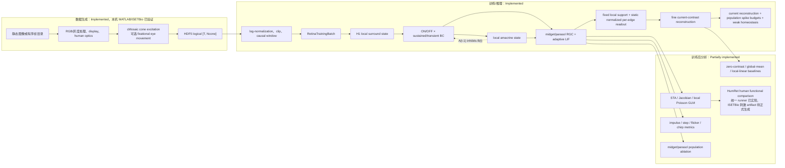

# Retina SNN 全链路代码审计报告

审计日期：2026-07-20。范围：当前工作树中的实际 Python、MATLAB、配置、测试与本地 BSDS300→ISETBio 自然图像微动 HDF5。外部生理评价以 [Bucci et al. (2025)](https://www.nature.com/articles/s41593-025-02011-3) 的人类中央视网膜时间响应、[Godat et al. (2022)](https://journals.plos.org/plosone/article?id=10.1371/journal.pone.0278261) 的猕猴 foveolar 空间调谐为主，HumRet 作为人类中周边功能群体的次级参照。

状态标签含义：`Implemented` 表示当前调用链可执行；`Partially implemented` 表示核心函数存在但没有端到端入口、外部参照数据或完整判据；`Planned` 表示仅在文档/研究设想中出现；`Unclear` 表示现有代码不足以确认。

## 1. 执行摘要

研究任务已冻结为：以自然静态图像经 ISETBio fixational eye movement 产生的 achromatic cone response 为输入，从局部、状态化、能量受限的 RGC-like population 重建 anchor 时刻的 clean normalized log cone contrast。输入历史与当前帧均完整可见；不再做人工遮蔽，也不构造或读取未来帧目标。因此任务是受 spike budget 约束的 current reconstruction / efficient-coding 检验，不是 predictive coding。训练损失没有 RF loss；STA、Jacobian 和局部 Poisson GLM 仅作为训练后读出。

当前可执行的最短链路是：自然图像 → MATLAB/ISETBio 微动序列 → HDF5 → train-only normalization → 完整 causal window → H1 → ON/OFF × sustained/transient bipolar → physiologically motivated local recurrent amacrine microcircuit → population-specific presynaptic local gain control → midget-like/parasol-like RGC → 固定局部 support、support 内逐边非负归一化的静态 decoder → current-contrast reconstruction。`decoder_warmup` 只训练 decoder；`core_finetune` 冻结 decoder，只训练 retina core，使第二阶段增益可归因于核心回路。

直接结论：**从代码可检验性看，当前架构已经具备检验“受人类/灵长类结构约束且能量受限的 SNN，能否在自然 cone 输入下形成 RGC-like、上下文依赖 RF”的必要通路；2026-07-20 的 v7 正式候选运行提高了 held-out reconstruction 与双 population 贡献，但 core-only finetune 恶化、impulse 无可测响应且 STA/Jacobian/GLM 严重不一致，因此尚未支持该生理假设。** checkpoint runner 已统一 current reconstruction、population usage/ablation、时间响应与 RF 三读出。低/高上下文比较保持最终 probe frame 完全相同，只改变此前历史；仍只有可重复、超过不确定性且出现适应—恢复方向性的变化，才能称为 dynamic RF。midget/parasol 一律保持 `-like` 表述。

2026-07-20 的方向性实验使用 UC Berkeley BSDS300 的 12 张 train 图像和 4 张独立 test 图像，经 ISETBio 生成为 4° 名义偏心度的 cone-response 微动序列。它仍是小样本工程判定，不是 HumRet 人体功能证据。

## 2. 端到端流程与实现状态



实际时序由 `models/retina_snn.py:74-140` 固定：`H1(t) → BC(t, A(t-1)) → A(t, BC(t)) → RGC(t, BC(t), A(t))`。没有显式整数 delay queue、buffer 或 `delay` 参数；局部 AC 对 BC 的负反馈来自前一时刻的 amacrine state。

## 3. 从输入图像到 ISETBio

`Implemented` 的 MATLAB 入口是 `scripts/matlab/generate_cone_h5_from_images.m:1-105`，Python 包装器为 `scripts/isetbio_stage1.py:55-184`。

| 步骤 | 实际实现 | 输入/输出 | 状态与限制 |
|---|---|---|---|
| 文件读取 | `load_input_frames`，支持 PNG/JPG/JPEG/TIF/TIFF/BMP（MATLAB:173-203） | 文件 → image array | `Implemented`；原图尺寸不固定，代码未保存原始 `Himg/Wimg` 到 HDF5。 |
| 通道处理 | `im2double`；灰度复制为 RGB；RGBA 去 alpha；achromatic 时 `Y=0.2126R+0.7152G+0.0722B` 再复制到三通道（205-220） | `[H,W,C]` → `[H,W,3]` | `Implemented`；通常 `im2double` 在 `[0,1]`，但代码没有独立数值范围断言。 |
| 尺寸 | `resize_nearest`（223-231） | `[H,W,3]` → `[image_size_px,image_size_px,3]` | `Implemented`；最近邻重采样，不是生理过程。 |
| 显示和光学 | `sceneFromFile`、`oiCreate('human')`、`oiCompute`（161-171） | RGB image → optical image | `Implemented`；需外部 ISETBio/ISETCam/display 文件，本次未运行 MATLAB。 |
| cone mosaic | `cMosaic`，设 integration time、eccentricity、FOV，且 `noiseFlag='none'`（107-115） | optical image → cone sampling positions | `Implemented`；不规则 cone mosaic；无 photoreceptor noise。 |
| 时间展开 | 静态图像 + eye movement：`emGenSequence`、`cm.compute(...withFixationalEyeMovements=true)`（130-144）；帧序列：逐帧 `cm.compute`（146-159） | 静态/帧目录 → `[T,Ncone]` | `Implemented`；eye movement 仅允许单张静态图，序列与 eye movement 同时启用会报错（40-43）。 |
| achromatic 导出 | 依据 cone type 路由到 LMS，再对 LMS 求和（65-76, 233-253） | `[T,Ncone]` → LMS `[T,Ncone,3]` 和 achromatic `[T,Ncone]` | `Implemented`；Python 训练只读取 achromatic response。 |

静态图像的时间变化不是由 Python 复制制造的：在 `eye_movement_enabled=true` 的单图路径中，ISETBio 的 fixational eye movement 改变 cMosaic 相对输入的位置；在 `eye_movement_enabled=false` 时，单图只被重复为 `T` 帧（55-58），没有内容时间变化。对于帧目录，时间变化来自逐帧内容，且 README 建议关闭 eye movement 以免混合两种时间来源（`README.md:147-152`）。

## 4. HDF5 数据契约

MATLAB 写出逻辑数组时反转维度以匹配 HDF5 存储（`generate_cone_h5_from_images.m:331-357`）。Python 的 `_logical_array` 只接受预期形状或二维转置（`data/cone_response.py:210-222`），再恢复逻辑 `[T,Ncone]` / `[Ncone,2]`。这不是学习层中的 `permute`，而是文件格式兼容。

| 字段 | 逻辑 shape / dtype | 生成与读取 | 是否进入训练 |
|---|---|---|---|
| `/cone_response_achromatic`（兼容 `/cone_response`） | `[T,Ncone]`, `float32`，isomerizations/integration time | MATLAB:75-93；Python:43-46 | 是，先 log-normalize。 |
| `/cone_response_lms` | `[T,Ncone,3]`, `float32` | MATLAB:75；`docs/isetbio_hdf5_contract.md:10-17` | 否，当前 loader 不读取。 |
| `/cone_xy_deg`（兼容 `/cone_positions_degs`） | `[Ncone,2]`, `float32`，visual degrees | MATLAB:78；Python:47-52 | 不作为动态输入；用于 mosaic、local support 与 target 位置。 |
| `/cone_type` | `[Ncone]`, `uint8` | MATLAB:79；Python:53-55 | 当前训练模型不使用；仅被保留/审计。 |
| `/time_axis_seconds` | `[T]`, `float64`，seconds | MATLAB:77；Python:56-60 | 间接：推导 `dt_ms`。 |
| `/eye_movement_xy_deg`（兼容 `/eye_trace_degs`） | `[T,2]`, `float32`，degrees | MATLAB:80；Python:61-66 | 否，元数据/复现诊断。 |
| `/response_units` | UTF-8 | MATLAB:96；Python:67 | 否，记录。 |
| `eccentricity_deg` attribute | scalar 或 `[x,y]` degrees | MATLAB:366；Python:68-84 | 间接：选择 foveal private-line 或 convergent midget 模式。 |
| `stimulus_source_kind` attribute / source ID | 文本 | MATLAB:30-35, 83-86, 371-375；Python:85-94 | `--formal-evidence` 接受 source-disjoint natural image microdrift 或 natural video；前者还要求非静态 eye trace。 |

Loader 要求 response 非负、有限，时间轴严格递增且帧间隔相对变异小于 `1e-3`（`data/cone_response.py:142-160`）。`dt_ms` 取 `median(diff(time_axis_seconds))*1000`（`configs/physiology_profiles.py:35-48`），不硬编码为生理传导延迟。

## 5. Dataset、时间对齐与 batch

`ISETBioDataset` 的正向数据流在 `data/dataset.py:141-275`，训练包装/拼接在 `datasets/isetbio_h5_dataset.py:46-110` 与 `datasets/retina_training_batch.py:24-35`。

1. 仅在 train HDF5 上以 `log(response+eps)` 拼接时间维度，逐 cone 计算 mean/std（`fit_log_cone_stats`, 45-59）。验证集复用这些统计量；训练入口在 `scripts/train_stage1.py:181-194` 中先拟合 train，再构造 train/val Dataset。
2. 将 log response 标准化并 clip 到 `[-clip,clip]`（`data/dataset.py:103-117`）；当前默认 `eps=1e-6, clip=5.0` 是工程数值，clip fraction 会记录并由训练入口阈值把关（172-177；`training/stage1_runtime.py:202-212`）。
3. 对 sample index `i`，anchor 为 `a=i+T_in-1`，输入为完整 clean causal history `C[a-T_in+1:a+1]`，target 为 `C[a]`。不遮蔽 anchor，也不访问 `a+1` 之后的数据。
4. clean current target 保持 cone 分辨率 `[Nc]`；当前主训练没有 coarse target、future target 或 mask。
5. collate 在 batch 维 stack，形成 `x_cone [B,Tin,Nc]` 与 `target_current [B,Nc]`。

时间轴示意（以代码为准）：

```text
sample i, anchor a=i+T_in-1
input : C[a-T_in+1], ..., C[a]
target: clean C[a]
loss  : all finite cone positions
```

当 `T=16, T_in=8` 时，有 `16-8+1=9` 个可用窗口；不再为 future horizon 丢弃末尾帧。

## 6. 张量形状账本

记号：`B` batch，`Tin` 输入时间步，`Nc` cone/BC 数，`NH` H1 数，`Nm/Np` 两类 RGC 数。当前模型没有规则二维 feature map；除了 H1 内部以 visual-degree 网格生成候选节点，张量均以扁平的局部 population 表示。

| 模块 | 变量 | 输入 → 输出 | 变化类型与信息含义 | 代码 |
|---|---|---|---|---|
| HDF5 | response | `[T,Nc]` → `[T,Nc]` | 读取/必要时二维转置；不改变逻辑信息 | `cone_response.py:38-66,210-222` |
| Dataset | contrast | `[T,Nc]` → `[T,Nc]` | log、逐 cone 标准化、clip；数值变换而非空间重采样 | `dataset.py:165-177` |
| Dataset | x/target | `[T,Nc]` → `[Tin,Nc]`, `[Nc]` | 完整 causal window；target 为 clean anchor | `dataset.py` |
| Target | current cone contrast | `[Nc]` → `[Nc]` | 保持 cone 分辨率；不增加 coarse 或 future 轴 | `dataset.py` |
| Batch | x/target | 单 sample → `[B,Tin,Nc]`, `[B,Nc]` | batch expansion | `retina_training_batch.py` |
| H1 | state/modulated drive | `[B,Nc]`,`[B,NH]` → `[B,Nc]`,`[B,NH]` | `Nc→NH→Nc` 两次 sparse local projection；最终 cone index 数不变，但邻域信息混合 | `horizontal.py:197-203` |
| BC | output | `[B,Nc]` → `[B,2,2,Nc]` | ON/OFF × sustained/transient channel expansion；不是空间上采样 | `bipolar.py:130-178` |
| Local AC | state | `[B,2,2,Nc]` → `[B,2,2,Nc]` | channelwise sparse local pooling + state recurrence；无 delay queue | `amacrine.py:150-162` |
| RGC | midget/parasol currents | `[B,2,2,Nc]` → `[B,2,Nm/Np]` | causal subunit energy gain → kinetics merge → fixed-support、positive row-normalized learnable pooling；两群体 LIF 参数独立但 bounds 相同 | `rgc.py` |
| RGC history | spikes/rates | 每步 `[B,2,N*]` → `[B,Tin,2,N*]` | temporal stack；保留每一输入时刻输出 | `retina_snn.py:169-188,236-243` |
| Decoder | current reconstruction | final `[B,2,Nm/Np]` → `[B,Nc]` | 固定 binary local support；support 内 spatial softmax 归一化，再按 polarity 合并 | `local_decoder.py` |

当前主路径的 population 尺寸记为 `B, Tin, Nc, NH, Nm, Np`；residual population 与 coarse head 已从主模型删除。旧 smoke 中的 `Nr/Ncoarse` 记录只属于历史实现，不能作为当前证据。

## 7. 坐标系、mosaic 与局部邻域

| 坐标/位置 | 当前实现 | 结论 |
|---|---|---|
| 输入像素 | MATLAB array index | 没有被导出为模型坐标。 |
| visual degrees | `cone_xy_deg: [Nc,2]` | 所有 local radius/sigma 的单位；不是像素，也不是归一化坐标。 |
| H1 | `_make_h1_grid_positions` 生成平面网格后删除无 cone 支持节点 | 唯一显式规则网格来源；输出仍为扁平 `[NH]`，无 `H×W` tensor。 |
| BC | 与 cone 相同位置、private source index | `Nc` 不变。 |
| midget | foveal mode 等于 cone positions；非 foveal 用 spatial cell subsampling | private-line 只被代码限制在 nominal eccentricity=0，不能推广到所有偏心度。 |
| parasol | 空间格子选代表点 | 不是直接按 cone 数组序号抽样。 |
| reconstruction target | cone positions | 保持 cone 分辨率；主训练无 coarse head。 |

`data/geometry.py:13-39` 构造稀疏 Gaussian 权重：`w_ji ∝ exp(-0.5(d_ji/sigma)^2) 1[d_ji≤radius]`，每个 target row 归一化至 1。没有 cone→grid interpolation 或 grid→cone resampling；H1、AC、RGC 和 decoder 均通过此类 sparse local edge set 在不规则/局部 population 上计算。

## 8. H1 horizontal stage

`Implemented`：`H1HorizontalNetwork`（`models/cells/horizontal.py:89-255`）。令 `W_CH∈R^{NH×Nc}`、`W_HC∈R^{Nc×NH}` 均为 row-stochastic sparse matrix：

```text
p_t = W_CH c_t
h_t = exp(-dt/tau_H) h_(t-1) + (1-exp(-dt/tau_H)) p_t
s_t = W_HC h_t
c'_t = c_t - g_H s_t
```

H1 接受 `[B,Nc]` cone drive，保持一个 `[B,NH]` 状态，输出 `[B,Nc]` modulated drive。`Nc→NH` 是 H1 population compression；`NH→Nc` 把 surround 投回原 cone 索引，最终形状不变但信息已按局部邻域混合。`tau_H` 和 `g_H` 是 sigmoid 有界可学习参数；本 profile 的初值/范围是模型先验，不能写作精确人体传导值（`configs/physiology_profiles.py:71-83`）。

## 9. Bipolar stage

`Implemented`：`BipolarLayer`（`models/cells/bipolar.py:18-205`）。每个 cone 位置只有一个 BC source index，故 BC 空间数仍是 `Nc`；通道而非空间维扩展为 `[B, polarity=2, kinetics=2, Nc]`。

```text
phi_s(x)=s softplus(x/s)
u_p=phi_s(g_p sign_p(c')-theta_p), sign_ON=+1, sign_OFF=-1
b_transient_drive=phi_s(u - baseline_(t-1))
z_t = leak ⊙ z_(t-1) + (1-leak)⊙[u,b_transient_drive] - g_AB⊙A_(t-1)
B_t=phi_s(z_t)
baseline_t = leak_sustained baseline_(t-1) + (1-leak_sustained)u
```

`state.output` 和 `state.transient_baseline` 分别为 `[B,2,2,Nc]`、`[B,2,Nc]`。ON/OFF 的符号固定，`g_p`、`theta_p` 与 `s` 是有界可学习潜变量；它们不是实测的人类 BC 参数。平滑整流保留弱的反偏好方向梯度，但不允许符号翻转。sustained/transient 的差异来自滤波与 transient baseline subtraction。没有单独的 midget BC、parasol BC 或 spatial parasol pooling；这些在 RGC 层才发生。

代码以 `ordered_taus` 保证**同一模型内** `tau_transient < tau_sustained`，但上下界可以重叠（`models/cells/temporal.py:31-49`）。这比强制两个范围完全不重叠更恰当：目前文献/模型抽象只可靠支持快慢顺序时，应固定顺序并以输出 impulse/step/flicker 指标校准；无依据的完全分离 bounds 会把工程假设伪装成生理事实。

## 10. Local amacrine stage

`Implemented` 的名称是 `LocalAmacrineLayer`，而非明确 A2 cell type（`models/cells/amacrine.py:16-187`）。应表述为 **physiologically motivated local recurrent amacrine microcircuit**。

它对 BC 输出在同一位置集合上做 row-normalized sparse local pooling，保留四个 ON/OFF×kinetics 通道：

```text
q_t = W_A B_t
A_t = leak_A ⊙ A_(t-1) + (1-leak_A) ⊙ g_BA ⊙ relu(q_t)
B_t already subtracts g_AB ⊙ A_(t-1)
```

所以存在最小 BC–AC 递归：`B(t)→A(t)` 与 `A(t-1)→B(t)`。不存在 queue/buffer，也不存在以 ms 或 step 参数化的 explicit delay；一时步因果反馈只能产生 emergent response latency，不能被称作生理 transmission delay。AC 输出既到下一步 BC，又在当前步送入 RGC 抑制项。

## 11. RGC populations

`Implemented`：`RGCPopulationLayer` 与两个独立的 `RGCAdaptiveLIF`。所有 population 均保留 ON/OFF 维 `[B,2,Npopulation]`；两套 LIF 使用相同宽 bounds 和初值，不预先虚构精确人类差异。

| 属性 | Midget-like | Parasol-like |
|---|---|---|
| 位置/数量 | fovea 可与 cone 一对一；否则较密 local mosaic | 由 spatial subsampling 产生，更稀疏 |
| pooling | private-line 或 local Gaussian | 更大 radius/sigma 的 local Gaussian |
| pooling 前 gain control | `B/(1+γ_m q_t)` | `B/(1+γ_p q_t)` |
| kinetics | learned ordered mix of sustained/transient | learned ordered mix of sustained/transient |
| AC 抑制 | `-g_AG,m W_m A_mixed` | `-g_AG,p W_p A_mixed` |
| 输出 | spike、smoothed rate | spike、smoothed rate |
| 约束 | 空间/数量/kinetic-order 约束 | 空间/数量/kinetic-order 及较高 `g_AG` 上限 |

关键审计发现：旧 `raw_kinetic_mix` 已被两个有序 latent 取代：midget 的 sustained 份额始终大于 transient，parasol 的 transient 份额始终大于 sustained，零 latent 给出数学 midpoint `[[0.75,0.25],[0.25,0.75]]`（`models/cells/rgc.py:116-145`）。这个 0.75 是数学/工程初值，不是精确生理估计；文献只支持 primate-compatible relative order，训练后仍须报告 mix 分布。

局部动态性不是只放在 RGC membrane 后端。每个 cone-aligned BC subunit 先维护 `q_t=α_q q_(t-1)+(1-α_q)B_t²`，再由 population-specific bounded gain `γ_m/γ_p` 归一化，之后才进入空间 pooling。这样 RF 的上下文依赖可由 pool 前局部适应产生，同时 anatomical support 保持固定。`tau_q` 与 `γ` 是 D 类有界潜变量，只能通过 RGC 输出与边界审计解释。

## 12. SNN 状态、spike 与 BPTT

单时间步顺序由 `RetinaSNNCore.step` 明确实现（`models/retina_snn.py:74-140`）：

```text
cone[t] → H1 state[t] → BC(B[t], A[t-1]) → AC A[t] → RGC current[t]
       → membrane pre-reset → threshold/surrogate spike → reset
       → adaptation[t] and rate-history[t]
```

状态包括 H1 `[B,NH]`、BC output `[B,2,2,Nc]`、BC transient baseline `[B,2,Nc]`、AC `[B,2,2,Nc]`、以及每个 RGC population 的 membrane/adaptation/rate `[B,2,N*]`（`RetinaSNNState`, 39-44；`RGCState`, `rgc_types.py:120-130`）。每个 `forward_sequence` 无给定 state 时重置为零；训练 batch 间不会延续 state。

Adaptive LIF 使用 membrane leak、hard threshold 配合 sigmoid surrogate gradient、spike reset、spike-triggered adaptation 与 fixed readout-rate low-pass（`rgc_runtime.py:71-89`）。`HybridRetinaTrainer.train_batch` 对前缀在 `no_grad` 下推进，detach state 后只对最后 `t_bptt` 帧回传（`training/hybrid.py:99-141`）。这是真正的 truncated BPTT；不是时间延迟机制。

## 13. Decoder 与重建对象

`Implemented`：`LocalDecoder`。训练时只读取 anchor/current 的最终 RGC rates，不对历史做 decoder-side temporal averaging。每个 population 的 target-source binary support 冻结；support 内每条空间边具有静态可学习 logit，并按 target row 做 softmax 精确归一化。随后用每个 population 的有界 signed ON/OFF coefficient 合并 polarity：

```text
P_current[j] = Σ_population∈{midget,parasol} Σ_p
               alpha_population[p] · (W_population R_population[t,p])[j]
```

target positions 是 cone positions。decoder 不学习 support、不读取 stimulus/target，也没有 sample-conditioned attention、hypernetwork 或动态 kernel。逐边权重只是固定 support 内的静态校准自由度；动态性必须来自 retina core。它是一项局部低容量工程 readout，不是生理细胞层，也不是 RF target。旧共享径向/temporal-decay 或 future-horizon checkpoint 与当前 schema 不兼容，必须 fresh run。

最终重建的是 anchor 时刻已 clip 的 normalized log cone contrast：

```text
P_current ≈ C_norm[t]
```

loss 在 anchor 时刻全部 cone 上计算。没有 future frame、mask 或 inverse-normalization output API。

## 14. Current target 构造

当前主目标直接保持 cone 分辨率 `[Nc]`。输入与 target 的 anchor 都完整可见；不再构造 mask、coarse target 或 future horizon。约束来自 population bottleneck、固定 local support 与 spike budget，而不是信息删除。

## 15. 训练阶段与优化器

| 阶段 | 实际入口/参数 | BPTT/梯度 | 状态 |
|---|---|---|---|
| Stage -1 | `scripts/isetbio_stage1.py` 调 MATLAB/ISETBio | 无 | `Implemented`，但外部 MATLAB/ISETBio 本次未运行。 |
| Stage 0 | HDF5 readback、Dataset tests、`isetbio_h5_gate.py` | 无 | `Partially implemented`；没有单独名为 Stage 0 的 CLI/report。 |
| Stage 1 | `decoder_warmup` | core 在 `no_grad`，decoder 更新 | `Implemented`。 |
| Stage 1B | learnability sweep | 无代码入口 | `Planned`。 |
| Stage 2 | `core_finetune` | decoder 冻结；最后 `t_bptt` 帧反传并只更新 core | `Implemented`；与 warmup 的差异可直接检验 retina core 是否承担任务。 |

优化器有 core 与 decoder 两个 AdamW parameter group，默认学习率分别为 `1e-4`、`1e-3`。checkpoint 保存 core、decoder、optimizer、stage；warmup checkpoint 初始化 core fine-tune。`--formal-evidence` 强制 held-out validation、来源互斥和足够 filtering context；自然图像证据还必须携带非静态 ISETBio eye trace。

## 16. 损失与正则

实际总损失（`loss/retina.py:100-133`）是：

```text
L = MSE(P_current, C_current) / MSE_train_baseline
  + λ_energy mean_pop mean_spike_pop/budget_pop
  + λ_homeo mean_pop relu(rate_floor-mean_rate_pop)^2
```

默认 `λ_energy=0.10`、`λ_homeostasis=1e-3`，两群体 spike/bin budget 均从 `0.10` 工程值开始。reconstruction 除以 train zero/global 最优 baseline MSE；能量项对每个 spike 都施加按 population budget 归一化的连续代价，使两项均无量纲。budget 是相对代价尺度而非硬生理阈值；homeostasis 只防止群体静默。没有 coarse head、residual、decorrelation 或 RF loss。budget、loss 权重、rate floor 都是 E 类工程参数，不是人类 firing-rate 数值。

## 17. 推理链路与泄漏检查

`HybridRetinaTrainer.evaluate_batch` 从零 state 对完整 `x_cone` 做因果前向，再从最终 RGC output 解码。RGC core 在每一时刻只接收当前/过去输入，不读取 target；不存在 future target、mask side channel 或 teacher forcing。

真正部署式推理仍是 `Partially implemented`：统一评价入口可以执行 checkpoint→train normalization→held-out HDF5→证据包，但没有逐样本 reconstruction export 或 inverse normalization。研究报告必须保存并复用 train-only statistics；不能在 test HDF5 上重新拟合。

## 18. Baseline、ablation、动力学和 RF 评价

| 项目 | 代码现状 | 能回答什么 | 缺口 |
|---|---|---|---|
| zero/global/local linear | `reconstruction_baselines.py`；统一入口 `scripts/evaluate_checkpoint.py` | 是否超过零对比、train global mean，并报告同局部 support 的线性上限 | 由于完整 current frame 可见，local linear 近似 identity ceiling，且不承担 spike budget；因此它单列报告，不进入主 `best_baseline` gate。 |
| population ablation | `population_ablation.py`；`checkpoint_metrics.py` | 消去 midget-like 或 parasol-like 后的输出/MSE 与贡献 | 已统一报告两类 population 的 usage、MSE delta 和绝对贡献。 |
| generic impulse/step/flicker/chirp | `dynamics.py`；`temporal_probes.py` | polarity-specific latency、time-to-peak、crossover、recovery、transience | ON 刺激与其取反的 OFF 刺激分别运行；明确标为 direct normalized-contrast diagnostic，不算正式 HumRet 输入。 |
| 人类/中央视网膜功能比较 | `humret.py`；`checkpoint_runner.py` 与外部 artifact | Bucci 2025 人类 foveal flash 为主要时间参照；Godat 2022 macaque foveolar tuning 为主要中央空间参照；HumRet 为次级中周边群体参照 | runner 不直接注入 contrast 模板；所有正式刺激须经过同一 ISETBio/normalization 前端。当前代码内 HumRet adapter 不应被写成完整中央视网膜评价。 |
| Jacobian RF | `gradient_rf`；`checkpoint_probes.py` | 最终 rate 对 cone time-history 的局部敏感度 | runner 对同一批刺激分别使用 `0.5×` 与 `1.0×` 对比度，保存同一 unit 的 Jacobian、waveform cosine、TTP shift 与 gain ratio；内容保持不变，避免把图像差异误当成上下文效应。该差异仍不单独证明 dynamic RF。 |
| white-noise STA | `white_noise_sta`；`checkpoint_probes.py` | 输出加权 STA | 已统一运行；仍是内部模拟白噪声，不是人类记录。 |
| local Poisson GLM | `fit_local_poisson_glm`；`checkpoint_probes.py` | 从 held-out spike count 拟合局部时空 RF | 已使用对应 RGC local pool support，与 STA/Jacobian 同包比较。 |
| RF map agreement | `rf_agreement.py:19-55` | 中心符号、centroid distance、cosine similarity | HumRet 不为每个单位提供匹配的白噪声 RF map；该项主要检验 STA/Jacobian/GLM 内部一致性及其他明确可比的人类 RF 数据。 |
| HumRet population comparison | `compare_humret_grating_population` | 群体平均 6×4 F1 tuning cosine、spatial/temporal preference distribution 的 total variation | 不内置“通过”阈值，需在正式实验前由重采样不确定性或预注册工程标准冻结。 |
| legacy functional summary | `functional.py:54-138` | chirp peak、contrast gain、grating preference 三个标量 | 保留兼容，不再作为主要人类证据；主分析应使用 HumRet 曲线/分布。 |
| feasibility decision | `feasibility.py` | 汇总结构、动力学、current-target skill、RF、functional gate | 统一 runner 自动收集代码内可得证据。 |

统一 runner 已把冻结 checkpoint 的 held-out current reconstruction、population usage/ablation、generic dynamics、RF 三读出、matched-probe 低/高历史上下文 Jacobian 和参数边界汇入同一证据包，但这仍不等于“动态 RF”或“RF 与人类一致性”已经成立。正式人类/猕猴比较只有在相应 photometric stimuli 经同一 ISETBio/normalization 前端并提供模型响应 artifact 后才可执行。

## 19. 历史 smoke 记录（旧 schema，仅作失败溯源）

本节以下旧结果来自 masked task、共享径向/temporal decoder 或 core+decoder 联合更新，不代表 2026-07-20 冻结的新 schema，也不能与新 checkpoint 直接比较。

命令：

```powershell
python scripts/audit_full_pipeline_shapes.py --device cpu
```

2026-07-20 运行了一次非正式候选训练：3 个 ISETBio 自然图像微动序列训练、1 个独立图像序列验证，`Tin=16`、2 epoch decoder warmup、5 epoch core+decoder 联合微调。该 run 只用于判断方向，不是正式证据。

| 量 | 实测结果 | 解释 |
|---|---:|---|
| held-out model MSE | 1.76578 | 仅略优于 zero-contrast 1.77485 |
| held-out local-linear MSE | 0.58206 | model skill 相对最强 baseline 为 -2.03367，任务表征未成立 |
| midget/parasol spike per bin | 0.0773 / 0.0907 | 两群体均活跃，未塌缩为全静默 |
| midget/parasol ablation ΔMSE | 0.00408 / 0.00498 | 两群体贡献非零但很小 |
| context audit | 16 steps = 80 ms；initialization error bound 0.726 | 未通过 initialization-forgetting gate；RF probe 按设计跳过 |
| dynamic RF | 无可报告结果 | 不能在任务 skill 与上下文 gate 失败时强行解释 Jacobian 差异 |

同日完成了共享径向 decoder 与 4° 名义偏心度的第二次方向性运行：BSDS300 官方 train/test 分别取 12/4 张互斥自然图像，每张经 ISETBio 微动生成 160 帧、29 cones；训练为 1 epoch decoder warmup + 5 epoch core fine-tune。decoder 从逐局部边参数化降为 12 个可学习标量。

| 量 | 实测结果 | 解释 |
|---|---:|---|
| held-out model MSE | 1.03399 | 优于 zero-contrast 1.04553，但改善只有约 1.1% |
| held-out local-linear MSE | 0.95034 | 相对最强 baseline skill 为 -0.0880；主任务贡献门槛失败 |
| midget/parasol spike per bin | 0.0941 / 0.1121 | 两群体均活跃 |
| midget/parasol ablation ΔMSE | 0.00562 / 0.00590 | 两群体贡献均非零但很小，尚无有力分工证据 |
| 281-step context audit | analytic sufficient；parasol relative RMS 0.0348 | 超过 0.01 empirical tolerance；midget 为 0.000031、重建为 0.00610 |
| RF / HumRet | RF 按 gate 跳过；HumRet `not_run` | 当前仍没有 dynamic RF 或人体功能一致性证据 |

这次结果排除了“decoder 参数过多”作为首要解释，但没有挽救主假设。当前更直接的缺口是训练窗口从零状态开始且只有 16 steps：模型可在 80 ms reset transient 上优化，却没有通过与慢滤波/适应状态相容的上下文稳定性检验。下一次实验若继续，应该用更长的前向 settling context、仍只对最后 `t_bptt` 帧反传；这不要求把 BPTT 本身拉长，也不支持新增细胞类型。

随后按同一数据切分、mosaic、seed、学习率与 1+5 epoch schedule 运行了 `input_steps=231, t_bptt=8` 的 settling 对照。12/4 张序列均扩展为 320 帧；每个训练样本先用 223 帧在 `no_grad` 下推进状态，只对最后 8 帧反传。

| 量 | 231/8 实测结果 | 解释 |
|---|---:|---|
| held-out model / zero MSE | 1.27399 / 1.28454 | 正 skill 仅 0.00821，仍是很弱的任务贡献 |
| midget/parasol spike per bin | 0.2127 / 0.1058 | 两群体活跃但使用不平衡 |
| midget/parasol ablation ΔMSE | 0.00684 / 0.00369 | 两群体贡献非零，parasol 更弱 |
| analytic initialization bound | 0.00985 | 通过 0.01 解析门槛 |
| paired-context relative RMS | midget 0.00184；parasol 0.03457；reconstruction 0.00717 | parasol 仍超过 0.01 empirical gate，且与短上下文 run 的 0.0348 几乎相同 |
| decoder radial/temporal split | 两类径向 mixture 与 temporal decay 仍近似相同 | 没有形成有力的 midget/parasol 读出分化 |
| RF / HumRet | RF skipped；HumRet `not_run` | settling 单独不足以产生可解释 dynamic RF 证据 |

因此“上下文过短”只是已修正的实验控制问题，不是当前失败的充分解释。继续单纯增加 settling 长度没有依据；下一步应针对 parasol hard-spike/adaptation 输出的上下文相位敏感性和主任务弱增益做单一根因审计，而不是加入新细胞类型或扩大 decoder。

起始参数实测为 H1 tau 50 ms；BC tau `[80,20]` ms；AC tau `[100,40]` ms；RGC adaptation/membrane tau `[80,20]` ms；midget/parasol kinetic mix 从有序数学 midpoint `[[0.75,0.25],[0.25,0.75]]` 开始。这些只是未训练模型的 filtering 参数或工程初值，不是可报告的生理反应延迟。

### 19.1 冻结新 schema 的单次方向性训练

2026-07-20 仅运行一次 `1 decoder warmup + 1 core-only finetune` CPU 小训练：1 张 BSDS300 train 图像与 1 张来源互斥的 validation 图像，各自经 ISETBio natural-image microdrift 生成 320 帧、29 cones；`input_steps=16, t_bptt=8`。这不是正式证据，也未扫参。

| 量 | 新 schema 实测 | 判定 |
|---|---:|---|
| held-out model / zero / global MSE | 6.30914 / 8.94190 / 8.97119 | 相对主 baseline skill = 0.29443；current reconstruction 已有方向性任务贡献。 |
| decoder-only warmup → core-only finetune MSE | 6.32430 → 6.30914 | decoder 冻结时 core 仍带来约 0.24% 额外改善；方向正确但证据弱。 |
| midget/parasol spike per bin | 0.27187 / 0.27152 | 两群体均活跃；held-out 活动高于 0.10 工程 budget，正式训练必须报告 budget violation。 |
| midget/parasol ablation ΔMSE | 1.32394 / 1.13772 | 两群体均有非退化贡献，不再只是名义分支。 |
| step transience / TTP（ON） | midget 0.305 / 160 ms；parasol 0.993 / 90 ms | 输出呈现预期的相对 sustained/fast-transient 顺序；这些是内部 normalized-contrast diagnostic，不是人体常数。 |
| matched-final-frame Jacobian | midget full cosine 0.397、final-frame cosine 0.681；parasol 0.623 / 0.525 | 历史上下文可改变梯度 RF shape 与 gain，不只是 decoder 动态；但仅一 unit/一 context，不能称为 dynamic RF 证据。 |
| context gate | analytic false；midget/parasol/current relative RMS 0.0455 / 0.00552 / 0.0112 | 16-step run 未消除初始化影响；统一 runner 按设计跳过正式 RF claim。 |

本次结果把架构从旧 schema 的 `No-Go` 提升为 **directionally viable / not yet formal Go**：任务 skill、两群体贡献、相对动力学和上下文敏感 Jacobian 同时出现，说明新信息流至少按设想工作；但短 context、单图像和弱 core-only 增益仍不足以支持人类 dynamic RF 结论。当前不应继续增加机制或扩大 decoder。

### 19.2 无量纲能量损失与 formal-context 单次训练

随后只做一次根因修正：reconstruction 使用 train baseline MSE 归一化；energy cost 改为相对 population budget 超额平方。checkpoint schema 更新为 `current_reconstruction_relative_energy_static_decoder_v6`。冻结其余架构后，在 8 张 train、3 张 source-disjoint validation 自然图像微动 HDF5 上运行 `input_steps=231, t_bptt=8`、1 epoch decoder warmup + 3 epoch core-only finetune；未扫参，总 CPU 时间约 10 分 25 秒。

| 量 | formal candidate 结果 | 判定 |
|---|---:|---|
| held-out model / zero MSE | 1.30672 / 1.94349 | skill = 0.32764，超过主 baseline。 |
| decoder warmup → core-only finetune MSE | 1.31579 → 1.30672 | core-only 三轮额外改善约 0.69%；方向为正但仍弱。 |
| held-out midget/parasol spike per bin | 0.16681 / 0.08364 | parasol 满足 0.10 工程 budget；midget 超预算约 67%，能量门槛失败。 |
| midget/parasol ablation ΔMSE | 0.35385 / 0.22038 | 移除后分别恶化约 27% / 17%，两群体均有实质贡献。 |
| analytic context | passed | 231 steps 满足解析 initialization residual 上界。 |
| paired empirical context RMS | midget 0.01644；parasol 0.0000009；reconstruction 0.00422 | midget 超过预注册 0.01 tolerance；formal runner 明确拒绝 checkpoint。 |
| RF probe | skipped: `empirical_context` | 没有绕过 gate，也没有产生 dynamic RF claim。 |
| temporal probe | impulse 四路及 OFF step 无 evoked response | 在进入人类比较前仍需解决输出/探针可测性；不能用内部 tau 代替。 |

因此这是迄今最好的任务与 population-usage 结果，但正式分类仍是 **Runs without full physiological support**，不是 Go：主要瓶颈已经从 decoder/任务不可学习转移为 midget settling 敏感性、midget energy budget violation 与部分标准刺激无响应。当前证据不支持增加新细胞类型或再次扩大 decoder。

### 19.3 Smooth bipolar、连续能量与 polarity-correct probes 的单次正式候选运行

v7 只合并三个已审计修正：ON/OFF 固定符号下的有界 smooth softplus transfer、对所有 spike 生效的连续无量纲能量代价，以及按刺激极性分别执行的 temporal probes。context formal gate 只约束 paired reconstruction 的稳定性；midget/parasol rate RMS 继续报告为 history sensitivity，不再被误当成初始化失败。checkpoint schema 为 `current_reconstruction_continuous_energy_smooth_bipolar_v7`。使用与 19.2 相同的 8/3 source-disjoint ISETBio 自然图像微动 HDF5、`input_steps=231`、`t_bptt=8`、1 epoch decoder warmup + 3 epoch core-only finetune；未扫参。因初始命令误用 CPU-only 环境，warmup checkpoint 落盘后切换到本机 `snn_env` 的 CUDA PyTorch 并续训；权重与 phase progress 没有重置。

| 量 | v7 最终 core checkpoint | 判定 |
|---|---:|---|
| held-out model / zero / global MSE | 1.10250 / 1.94349 / 2.47787 | 相对最佳主 baseline skill = 0.43272；较 v6 的 0.32764 明显提高。 |
| decoder warmup → 三轮 core-only MSE | 1.08521 → 1.09125 → 1.09916 → 1.10250 | core-only 最终比 warmup 恶化约 1.59%；按冻结判据直接否定“core 学习带来任务增益”。 |
| held-out midget/parasol spike per bin | 0.16819 / 0.09104 | 两群体均活跃；midget 仍高于 0.10 工程 budget，连续能量没有在三轮内消除该偏差。 |
| midget/parasol ablation ΔMSE | 0.41193 / 0.28763 | 移除任一群体都显著恶化 reconstruction；双 population 不是名义分支。 |
| formal context | analytic passed；reconstruction RMS 0.00951 | 通过 1% paired reconstruction tolerance；midget/parasol rate RMS 0.0190 / 0.0348 只解释为 history sensitivity。 |
| step TTP / transience | midget 130–135 ms / 0.273–0.294；parasol 85–95 ms / 0.768–0.772 | 输出呈预期相对 sustained/fast-transient 顺序；仍只是 normalized-contrast diagnostic。 |
| impulse | 四个 population×polarity 条件均 `no_evoked_response` | 生理 probe 可测性失败，不能以内部 tau 替代。 |
| STA/Jacobian/GLM cosine | −0.0079 至 0.2221 | 三种 RF 读出严重不一致；即使 context gain/TTP 有变化，也不能称为可靠 dynamic RF。 |
| smooth bipolar latent | gain 0.998/1.011；threshold 0.0015/−0.0057；softness 0.0465 | 均未贴边，说明 bounds 没有直接夹死；但本次数据也未形成强 ON/OFF 不对称。 |
| HumRet | `not_run` | 本地缺少 HumRet reference 与经同一 ISETBio 前端生成的 model-response artifact；没有人体功能一致性证据。 |

该运行是 **prediction/usage improved, physiology hypothesis not supported**。它证明 current-reconstruction bottleneck 能使用两个 population，也证明相对 midget/parasol 时间顺序可测；但 core-only 泛化恶化、impulse 静默和 RF 三读出不一致共同触发既有 No-Go/简化条件。下一步不应增加细胞类型、显式 delay、STP 或 decoder 容量；应先定位为何 core 更新降低 held-out 表现，以及为何标准小扰动不能驱动可重复的同一-unit RF。任何修正仍须维持固定局部 support、无 RF loss 与单次小规模可证伪训练。

## 20. 时间参数与未知参数处理

| 量 | 现有实现 | 正确解释 | 建议校准对象 |
|---|---|---|---|
| `dt_ms` | 从 HDF5 time axis 得到 | 数据采样间隔 | HDF5 contract。 |
| H1/BC/AC/RGC tau | bounded learnable，RGC rate tau 当前 fixed buffer | filtering time constant；不是 transmission delay | RGC impulse、step、flicker/chirp 的 latency、time-to-peak、crossover、recovery、transience。 |
| local subunit `tau_q` / gain `γ_m,γ_p` | bounded learnable，pooling 前作用 | 上下文能量状态与归一化强度；不是细胞类型真值或传导延迟 | matched-final-probe Jacobian 的 shape/gain 变化、适应与恢复，以及参数是否贴边。 |
| midget/parasol adaptive LIF | 两套独立参数、相同 bounds/初值 | 允许由任务形成差异，但不预设精确人类数值 | 两群体各自 impulse/step/flicker/chirp 输出与 population usage。 |
| BC/RGC 离散更新 | BC: `B_t=φ_s(αB_{t-1}+(1-α)(D_t-g_AB A_{t-1}))`；RGC reset 前：`V_t^-=αV_{t-1}+(1-α)(I_t-a_{t-1})` | 同一连续一阶滤波方程的指数离散化；BC 的 smooth gain/threshold/softness、`g` 与 normalized current 仍是模型量 | 改变 `dt_ms` 时稳态驱动不应被无意改变；以人类输出响应而不是内部状态幅度校准。 |
| BC `tau_transient < tau_sustained` | `ordered_taus` 强制 | 同模型中的快慢顺序 | 不要求 bounds 完全不重叠。 |
| `A(t-1)→B(t)` | state recurrence | 离散一步的因果反馈 | 可导致 emergent latency，不能称为显式生理 delay。 |
| explicit delay | 无代码 | 当前架构不存在 | 仅在 filtering 无法解释稳定的输出 latency 偏差后，才应新增有单位、可审计的整数 delay。 |
| RGC readout rate tau | profile 固定 50 ms | rate-smoothing 工程/潜在模型参数 | 需用时间动力学输出验证，不能直接从 spike latency 推断。 |

参数证据等级应按下列方式报告，而不是把 profile 中的具体数字当作已证实人体常数：

| 等级 | 当前例子 |
|---|---|
| A 数据直接决定 | cone positions、time axis/dt、train-only normalization statistics、clean current target、真实 HDF5 source provenance。 |
| B 强结构约束 | 因果顺序、ON/OFF 符号分支、局部非负 row-normalized pooling、foveal-only private line 限制。 |
| C 文献支持的可观测响应约束 | Bucci 2025 人类 foveal/foveolar flash dynamics；Godat 2022 macaque foveolar spatial tuning；HumRet 人类中周边 flash/chirp/grating 群体分布。三者不合并成同一 ground truth；HumRet 聚类不作为形态学 cell-type 标签。 |
| D 有界可学习潜变量 | H1/BC/AC/RGC tau、subunit adaptation tau/gain、inhibitory gains、midget/parasol kinetic mix 与独立 LIF latent。 |
| E 工程/优化 | clip、loss weights、surrogate slope、threshold、BPTT、gradient clip、decoder weight bound。 |

训练后应检查 D 类参数是否堆积在边界；`evaluation/parameter_audit.py` 已能记录 tau/gain/mix 与 decoder weight 的边界距离。

## 21. 当前实现缺口与风险

1. **正式规模证据未完成。** 当前 natural-image microdrift HDF5 已具备 source ID 与非静态 eye trace，代码允许其通过 provenance gate；但正式训练仍需更多来源互斥图像与足够 filtering context。
2. **midget/parasol temporal claim 只有限定先验。** 当前代码只固定 midget sustained>transient、parasol transient>sustained 的 relative order；0.75 是工程 midpoint，不能写成精确生理值。
3. **中央视网膜外部 artifact 仍缺。** checkpoint 编排已经统一，但 Python runner 不替代 ISETBio；Bucci flash、Godat grating/tuning 与 HumRet 刺激必须先经相同 human optics/cone front end，再把模型响应 artifact 交给比较层。
4. **评价阈值部分是工程决定。** `FeasibilityReport` 的 skill/RF 阈值与 `--max-clip-fraction 0.01` 都不是生理常数；应冻结为预注册式项目判据并版本化。
5. **文档漂移风险。** 历史参数审计文本必须按当前代码重新核对；旧 routing、optimizer 或 residual 说法不得作为实现证据。
6. **评价 sample metadata 丢失。** `RetinaTrainingBatch` 不带 `time_index/source id/eye trace`，会增加 trace-level 诊断难度，但不影响当前因果训练。
7. **HumRet 不是细胞类型真值集。** 该研究的人类单位没有形态学鉴定；功能模板或聚类只能用于次级探索，不能把某个 cluster 直接命名为 midget/parasol 后据此调参。

## 22. 冻结后的最小评价与 7 月底证据包

不需要大型消融矩阵。最小证据包应只含：

1. source-disjoint natural-image microdrift train/validation HDF5，固定 mosaic/normalization contract，保存非静态 eye trace，并通过 `--formal-evidence` 的 initialization-forgetting context gate。
2. held-out current MSE 相对 zero-contrast/global-mean 的主 skill；local-linear 作为不受 spike budget 的近 identity ceiling 单列报告。
3. decoder warmup 与 core fine-tune 的差异，证明训练 core 而非仅 decoder 能带来增益。
4. 两类 population usage，以及 midget-like/parasol-like 单独 ablation；要求两者均有非退化贡献。
5. 每类 RGC 的 generic impulse/step/flicker response 与 latency、time-to-peak、crossover、recovery、transience；这些指标与内部 `tau` 分开报告。
6. 人类中心评价：Bucci 2025 human foveal/foveolar flash 为主要时间目标；Godat 2022 macaque foveolar spatial tuning 为主要中央空间目标；HumRet 只作人类中周边 flash/chirp/grating 群体次级评价。所有刺激经 ISETBio 与 train normalization；任何 reference 都不按未经形态鉴定的 midget/parasol 硬标签拆分。
7. 在 formal context、positive current-target skill 和 nondegenerate midget/parasol activity gate 之前跳过 RF claim；通过后再报告 STA、Jacobian、local GLM 内部一致性，以及同一 unit 在内容匹配的低/高对比、适应和恢复上下文中的 RF。只有 context effect 可重复、超过 bootstrap/重复估计不确定性且出现适应—恢复方向性，才表述为 dynamic RF。HumRet 没有逐单位匹配白噪声 RF 时，不伪造直接 RF-map 对齐。
8. 参数边界审计、H1/AC/RGC activity diagnostic 和 clip fraction。

Go/No-Go 应保持少量且可证伪：

| 决定 | 最小条件 |
|---|---|
| Go | 结构/provenance 合规；core-finetune 后 current reconstruction 超过 zero/global 且优于 decoder-only warmup；midget/parasol 均有非退化贡献；STA/Jacobian/GLM 对中心符号和主要时空结构一致；至少一组 matched-final-probe 的同-unit RF shape/gain 变化可重复且大于不确定性；主要中央时间/空间人类或灵长类指标不系统性失败；D 类参数不系统贴边。 |
| Runs without support | 数值可运行且 reconstruction 有增益，但增益只来自 decoder、任一 population 贡献接近零、RF 三读出不一致，或上下文效应仅是统一 gain 缩放。此结果只支持“可重建 current contrast”，不支持“形成 dynamic human-RGC-like RF”。 |
| No-Go / simplify | core-finetune 不优于 warmup或不超过 zero/global；任一主 population 塌缩；matched-context Jacobian 无 shape/gain 变化；多数 RGC 无可测时间响应；或合理校准后中央空间与时间评价同时失败。先删除无贡献机制，不为改善 loss 扩大 decoder。 |
| 加新生理机制的门槛 | 只有在结构、单位、刺激和参数边界均合规，且一个具体人类输出缺口跨 seed/样本稳定复现时才成立。例如，仅当 bounded filtering 无法消除量化的 response-latency 偏差，才考虑显式整数 delay。当前证据不足以加入 A1、A3、gap coupling、vGluT3、STP 或 cortical feedback。 |

## 23. P0/P1 状态与后续代码清单

| 优先级 | 必要改动 | 理由 |
|---|---|---|
| P0 已完成 | 删除 future/coarse/residual/mask 主路径；完整 current input + population spike budget 成为唯一主任务。 | 主任务与 efficient-coding 假设一致，不再依赖预测或人工缺失值。 |
| P0 已完成 | 在 RGC spatial pooling 前加入 bounded local subunit gain；midget/parasol 改为独立 LIF；decoder 改为静态逐边 local projection，core-finetune 冻结 decoder。 | 动态性可发生在局部视网膜状态中，readout 不再通过 temporal averaging 或动态 kernel 冒充 RF。 |
| P0 已完成 | formal provenance gate 接受 source-disjoint natural-image microdrift，并要求非静态 ISETBio eye trace。 | 自然静态图像可作为正式时序 retinal input，不再被旧 natural-video-only gate 错误拒绝。 |
| P0 已完成 | `scripts/evaluate_checkpoint.py` 加载 checkpoint 和 train stats，产出 held-out baseline skill、population usage/ablation、generic temporal probes、STA/Jacobian/local GLM、parameter audit，并可接收外部 ISETBio-derived HumRet grating F1 artifact。 | 评价函数已汇入单一 JSON+NPZ 证据包；runner 拒绝把内部 contrast 模板冒充正式人类比较。 |
| P0 | 冻结 Bucci 2025 human foveal temporal、Godat 2022 macaque foveolar spatial 与 HumRet mid-peripheral secondary comparison configuration。 | 三类 reference 不能互相替代；代码故意不虚构 cosine/TV/response-range 阈值。 |
| P0 | 报告 midget/parasol kinetic mix 的学习后分布；不新增硬 exclusive routing。 | 避免把当前 0.75 工程 midpoint 错称为精确生理分工，也避免用 HumRet 未形态鉴定的聚类反向强迫分路。 |
| P0 | 修复/归档与实际代码不一致的参数审计文档。 | 防止旧 A2/routing/optimizer 说法污染方法证据。 |
| P1 | 在 analysis batch 中可选保留 sample time index、source ID、eye trace。 | 支持按电影/时间点的 RF 与失败追踪。 |
| P1 | 增加独立 inference CLI 与 inverse-normalization/export 约定。 | 便于在 held-out sequence 上审计 reconstruction，不改变训练核心。 |
| P1 | 将 feasibility thresholds 移到带出处/版本的实验配置。 | 区分预注册判据、经验阈值和生理参数。 |

## 24. 审计与统一评价入口

`scripts/audit_full_pipeline_shapes.py` 是只读工具：加载一份 HDF5、使用数据派生的 `dt_ms` 和当前 `build_stage1_components` 构建模型，读取一个 batch，在 `torch.inference_mode()` 下进行**一次** forward，并打印 shape、dtype、device、min/max/mean/std、最终状态和动力学诊断。它不训练、不写入 HDF5、checkpoint 或 normalization 文件。

默认命令：

```powershell
python scripts/audit_full_pipeline_shapes.py --device cpu
```

可用 `--h5` 与 `--input-steps` 替换 smoke 输入。脚本与训练入口采用同一 foveal/private-line 选择逻辑，适合检查数据到核心模型的真实接口，不替代正式训练或生理验证。

冻结 checkpoint 后使用统一只读评价入口：

```powershell
python scripts/evaluate_checkpoint.py `
  --checkpoint runs/stage1_finetune/best_checkpoint.pt `
  --normalization-stats runs/stage1_finetune/normalization_stats.npz `
  --train-h5 data/train_a.h5 data/train_b.h5 `
  --eval-h5 data/test_a.h5 `
  --output-dir runs/stage1_finetune/test_evaluation `
  --input-steps 231 --device cuda --formal-evidence
```

该命令不训练、不更新参数、不在 held-out 数据上重拟合 normalization 或 baseline。输出 `evaluation_summary.json` 与 `rf_probes.npz`。如需 HumRet 功能比较，还必须同时给出 `--humret-root` 和经同一 ISETBio human optics/cone front end 生成的 `--humret-model-response` artifact；缺少时 JSON 明确记录 `not_run`。

本次为本报告新增的文件：

- `docs/retina_snn_full_pipeline_report.md`
- `scripts/audit_full_pipeline_shapes.py`
- `evaluation/humret.py`
- `evaluation/checkpoint_contracts.py`
- `evaluation/checkpoint_metrics.py`
- `evaluation/checkpoint_probes.py`
- `evaluation/checkpoint_runner.py`
- `evaluation/checkpoint_tensors.py`
- `scripts/evaluate_checkpoint.py`
- `tests/test_checkpoint_evaluation.py`
- `tests/test_humret_evaluation.py`

2026-07-20 已在本机 CUDA 环境完成 19.3 所述的一次正式候选训练与一次统一 checkpoint evaluation，产物位于 `runs/formal_smooth_bipolar_continuous_energy_20260720_restart2/`。本轮没有运行 MATLAB/ISETBio 再生成、参数扫描或完整 pytest；只运行了针对四项修改的定向测试与现有 8/3 HDF5 证据包。HumRet reference/model-response artifact 未提供，故人体比较明确为 `not_run`。

仍无法确认的问题包括：midget empirical settling failure 消除后的 RF repeatability、Bucci/Godat/HumRet 比较阈值与重采样区间，以及人类中央视网膜功能一致性是否成立。已有 HumRet adapter 不等于模型已经通过人类评价。

## 25. 最终判断

**直接回答：当前架构足以执行“受人类/灵长类结构约束、能量受限的 SNN 能否在自然 cone 输入下形成 RGC-like RF”这一可证伪检验，但当前训练设计与结果不足以支持它已经形成可靠的 RGC-like dynamic RF；v7 按冻结标准仍是 No-Go/需简化，而不是最终实验版本。**

v7 在 8/3 张 source-disjoint natural images、231-step context 下取得 0.4327 held-out skill，midget/parasol ablation 均显著，paired reconstruction context gate 也通过；这证明任务和双 population 信息流是可用的。相反证据同样明确：core-only MSE 从 warmup 的 1.0852 恶化到 1.1025，四路 impulse 无 evoked response，STA/Jacobian/GLM cosine 最高仅 0.222，HumRet 未运行。现阶段只能主张“可重建 current contrast、两群体均有贡献、相对时间顺序出现”，不能主张“自然输入下形成了可靠的人类 RGC-like dynamic RF”。下一步应优先简化或修正 core 学习与 probe 可测性的冲突；不是加入 A1/A3/gap coupling/vGluT3/STP/cortical feedback、显式 delay 或更大 decoder。
