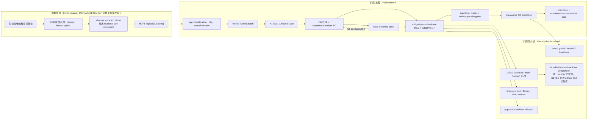

# Retina Predictive SNN 全链路代码审计报告

审计日期：2026-07-14。范围：当前工作树中的实际 Python、MATLAB、配置、测试、一份本地 ISETBio HDF5 smoke 文件，以及 [Reinhard & Münch (2021)](https://doi.org/10.1371/journal.pone.0246952) 原文和官方 [HumRet 数据/代码](https://github.com/katjaReinhard/HumRet)；未启动正式训练。

状态标签含义：`Implemented` 表示当前调用链可执行；`Partially implemented` 表示核心函数存在但没有端到端入口、外部参照数据或完整判据；`Planned` 表示仅在文档/研究设想中出现；`Unclear` 表示现有代码不足以确认。

## 1. 执行摘要

研究任务在代码中落实为：以 ISETBio 导出的 achromatic cone response 为输入，预测短时程未来的、局部汇聚后的归一化对数 cone-contrast change，而不是图像类别，也不是直接拟合感受野（receptive field, RF）目标。训练损失没有 RF loss；STA、Jacobian 和局部 Poisson GLM 是训练后的读出工具。

当前可执行的最短链路是：图像/帧目录 → MATLAB/ISETBio → HDF5 → Dataset/Batch → H1 → ON/OFF × sustained/transient bipolar → generic local recurrent amacrine microcircuit → midget-like/parasol-like/residual RGC → 低容量 local decoder → fine/coarse future change。主训练入口只实现 `decoder_warmup` 与 `core_finetune` 两阶段。

直接结论：**当前架构足以检验“在局部、因果、低容量读出约束下，预测任务是否能形成可读出的、且功能响应接近人类 RGC 群体的 RGC-like RF”；尚不足以支持“已形成经形态鉴定的人类 midget/parasol 功能分工”这一更强主张。** 端到端预测训练、checkpoint 驱动的统一 post-training runner、RF 探针、HumRet MAT 读取以及与原论文一致的 chirp/flash/drifting-grating 刺激接口已经实现。尚缺的决定性证据是真实 natural-video 正式训练、经 ISETBio 前端生成的 HumRet 模型响应 artifact，以及冻结后的 HumRet 群体比较结果。HumRet 论文没有对记录单位做形态学细胞类型鉴定，因此当前 midget/parasol kinetics mix 是否分化必须作为模型输出检验，不能用 HumRet 聚类反向定义成真值。

本次仅做一次 CPU、单 batch、推理模式前向。使用的是 `data/isetbio_local_smoke/input_seed7.h5`；它的 `stimulus_source_kind` 缺失，因此不是正式 natural-video 证据。

## 2. 端到端流程与实现状态



实际时序由 `models/retina_snn.py:74-140` 固定：`H1(t) → BC(t, A(t-1)) → A(t, BC(t)) → RGC(t, BC(t), A(t))`。没有显式整数 delay queue、buffer 或 `delay` 参数；局部 AC 对 BC 的负反馈来自前一时刻的 amacrine state。

## 3. 从输入图像到 ISETBio

`Implemented` 的 MATLAB 入口是 `scripts/matlab/generate_cone_h5_from_images.m:1-105`，Python 包装器为 `scripts/isetbio_stage1.py:55-184`。

| 步骤 | 实际实现 | 输入/输出 | 状态与限制 |
|---|---|---|---|
| 文件读取 | `load_input_frames`，支持 PNG/JPG/JPEG/TIF/TIFF/BMP（MATLAB:173-203） | 文件 → image array | `Implemented`；原图尺寸不固定，代码未保存原始 `Himg/Wimg` 到 HDF5。 |
| 通道处理 | `im2double`；灰度复制为 RGB；RGBA 去 alpha；achromatic 时 `Y=0.2126R+0.7152G+0.0722B` 再复制到三通道（205-220） | `[H,W,C]` → `[H,W,3]` | `Implemented`；通常 `im2double` 在 `[0,1]`，但代码没有独立数值范围断言。 |
| 尺寸 | `resize_nearest`（223-231） | `[H,W,3]` → `[image_size_px,image_size_px,3]` | `Implemented`；最近邻重采样，不是生理过程。 |
| 显示和光学 | `sceneFromFile`、`oiCreate('human')`、`oiCompute`（161-171） | RGB image → optical image | `Implemented`；需外部 ISETBio/ISETCam/display 文件，本次未运行 MATLAB。 |
| cone mosaic | `cMosaic`，设 integration time、eccentricity、FOV，且 `noiseFlag='none'`（107-115） | optical image → cone sampling positions | `Implemented`；不规则 cone mosaic；无 photoreceptor noise。 |
| 时间展开 | 静态图像 + eye movement：`emGenSequence`、`cm.compute(...withFixationalEyeMovements=true)`（130-144）；帧序列：逐帧 `cm.compute`（146-159） | 静态/帧目录 → `[T,Ncone]` | `Implemented`；eye movement 仅允许单张静态图，序列与 eye movement 同时启用会报错（40-43）。 |
| achromatic 导出 | 依据 cone type 路由到 LMS，再对 LMS 求和（65-76, 233-253） | `[T,Ncone]` → LMS `[T,Ncone,3]` 和 achromatic `[T,Ncone]` | `Implemented`；Python 训练只读取 achromatic response。 |

静态图像的时间变化不是由 Python 复制制造的：在 `eye_movement_enabled=true` 的单图路径中，ISETBio 的 fixational eye movement 改变 cMosaic 相对输入的位置；在 `eye_movement_enabled=false` 时，单图只被重复为 `T` 帧（55-58），没有内容时间变化。对于帧目录，时间变化来自逐帧内容，且 README 建议关闭 eye movement 以免混合两种时间来源（`README.md:147-152`）。

## 4. HDF5 数据契约

MATLAB 写出逻辑数组时反转维度以匹配 HDF5 存储（`generate_cone_h5_from_images.m:331-357`）。Python 的 `_logical_array` 只接受预期形状或二维转置（`data/cone_response.py:210-222`），再恢复逻辑 `[T,Ncone]` / `[Ncone,2]`。这不是学习层中的 `permute`，而是文件格式兼容。

| 字段 | 逻辑 shape / dtype | 生成与读取 | 是否进入训练 |
|---|---|---|---|
| `/cone_response_achromatic`（兼容 `/cone_response`） | `[T,Ncone]`, `float32`，isomerizations/integration time | MATLAB:75-93；Python:43-46 | 是，先 log-normalize。 |
| `/cone_response_lms` | `[T,Ncone,3]`, `float32` | MATLAB:75；`docs/isetbio_hdf5_contract.md:10-17` | 否，当前 loader 不读取。 |
| `/cone_xy_deg`（兼容 `/cone_positions_degs`） | `[Ncone,2]`, `float32`，visual degrees | MATLAB:78；Python:47-52 | 不作为动态输入；用于 mask、mosaic、target 位置。 |
| `/cone_type` | `[Ncone]`, `uint8` | MATLAB:79；Python:53-55 | 当前训练模型不使用；仅被保留/审计。 |
| `/time_axis_seconds` | `[T]`, `float64`，seconds | MATLAB:77；Python:56-60 | 间接：推导 `dt_ms`。 |
| `/eye_movement_xy_deg`（兼容 `/eye_trace_degs`） | `[T,2]`, `float32`，degrees | MATLAB:80；Python:61-66 | 否，元数据/复现诊断。 |
| `/response_units` | UTF-8 | MATLAB:96；Python:67 | 否，记录。 |
| `eccentricity_deg` attribute | scalar 或 `[x,y]` degrees | MATLAB:366；Python:68-84 | 间接：选择 foveal private-line 或 convergent midget 模式。 |
| `stimulus_source_kind` attribute / `/source_movie_id` | 文本 | MATLAB:30-35, 84-86, 371-372；Python:85-94 | 仅 `--formal-evidence` provenance gate。 |

Loader 要求 response 非负、有限，时间轴严格递增且帧间隔相对变异小于 `1e-3`（`data/cone_response.py:142-160`）。`dt_ms` 取 `median(diff(time_axis_seconds))*1000`（`configs/physiology_profiles.py:35-48`），不硬编码为生理传导延迟。

## 5. Dataset、时间对齐与 batch

`ISETBioDataset` 的正向数据流在 `data/dataset.py:141-275`，训练包装/拼接在 `datasets/isetbio_h5_dataset.py:46-110` 与 `datasets/retina_training_batch.py:24-35`。

1. 仅在 train HDF5 上以 `log(response+eps)` 拼接时间维度，逐 cone 计算 mean/std（`fit_log_cone_stats`, 45-59）。验证集复用这些统计量；训练入口在 `scripts/train_stage1.py:181-194` 中先拟合 train，再构造 train/val Dataset。
2. 将 log response 标准化并 clip 到 `[-clip,clip]`（`data/dataset.py:103-117`）；当前默认 `eps=1e-6, clip=5.0` 是工程数值，clip fraction 会记录并由训练入口阈值把关（172-177；`training/stage1_runtime.py:202-212`）。
3. 对 sample index `i`，anchor 为 `a=i+T_in-1`，输入为 `C[a-T_in+1:a+1]`，未来 target 为每个 horizon `h` 的 `C[a+h]-C[a]`（`data/dataset.py:252-265`）。因此没有将 future frame 放入 `x_cone`。
4. fine/coarse target pool 以 sparse matrix multiply 从 `[H,Ncone]` 变为 `[H,Nfine]`、`[H,Ncoarse]`（266-274）。
5. collate 在 batch 维 stack，只保留 `x_cone` 与 fine/coarse targets。`time_index` 与未池化的 `target_delta` 在 `RetinaTrainingBatch` 中被丢弃（`datasets/retina_training_batch.py:24-35`）。这对训练足够，但限制逐样本对齐审计。

时间轴示意（以代码为准）：

```text
sample i, anchor a=i+T_in-1
input : C[a-T_in+1], ..., C[a]
target: ΔC_h = C[a+h] - C[a], h ∈ horizons
```

当 `T=16, T_in=8, horizons=(1,2,4)` 时，有 `16-8-4+1=5` 个可用窗口；末尾不足以给出最大 horizon 的时间点被正确丢弃（`data/dataset.py:197-199`）。

## 6. 张量形状账本

记号：`B` batch，`Tin` 输入时间步，`H` horizon 数，`Nc` cone/BC 数，`NH` H1 数，`Nm/Np/Nr` 三类 RGC 数。当前模型没有规则 `H×W` feature map；除了 H1 内部以 visual-degree 网格生成候选节点，张量均以扁平的局部 population 表示。

| 模块 | 变量 | 输入 → 输出 | 变化类型与信息含义 | 代码 |
|---|---|---|---|---|
| HDF5 | response | `[T,Nc]` → `[T,Nc]` | 读取/必要时二维转置；不改变逻辑信息 | `cone_response.py:38-66,210-222` |
| Dataset | contrast | `[T,Nc]` → `[T,Nc]` | log、逐 cone 标准化、clip；数值变换而非空间重采样 | `dataset.py:165-177` |
| Dataset | x/target | `[T,Nc]` → `[Tin,Nc]`, `[H,Nc]` | temporal window 和未来 shift；末尾帧丢弃 | `dataset.py:252-265` |
| Target pools | fine/coarse | `[H,Nc]` → `[H,Nfine/Ncoarse]` | sparse local projection；coarse 是空间压缩 | `dataset.py:266-274` |
| Batch | x/targets | 单 sample → `[B,Tin,Nc]`, `[B,H,Nfine/Ncoarse]` | batch expansion；不丢空间信息 | `retina_training_batch.py:24-35` |
| H1 | state/modulated drive | `[B,Nc]`,`[B,NH]` → `[B,Nc]`,`[B,NH]` | `Nc→NH→Nc` 两次 sparse local projection；最终 cone index 数不变，但邻域信息混合 | `horizontal.py:197-203` |
| BC | output | `[B,Nc]` → `[B,2,2,Nc]` | ON/OFF × sustained/transient channel expansion；不是空间上采样 | `bipolar.py:130-178` |
| Local AC | state | `[B,2,2,Nc]` → `[B,2,2,Nc]` | channelwise sparse local pooling + state recurrence；无 delay queue | `amacrine.py:150-162` |
| RGC | midget/parasol/residual currents | `[B,2,2,Nc]` → `[B,2,Nm/Np/Nr]` | kinetics merge + local sparse pooling；parasol/residual 通常为 population compression | `rgc.py:197-215` |
| RGC history | spikes/rates | 每步 `[B,2,N*]` → `[B,Tin,2,N*]` | temporal stack；保留每一输入时刻输出 | `retina_snn.py:169-188,236-243` |
| Decoder | fine/coarse prediction | final `[B,2,Nm/Np/Nr]` → `[B,H,Nfine/Ncoarse]` | 固定 sparse local mask 后按 polarity/horizon 合并 | `local_decoder.py:151-160,223-231` |

本次实际审计值：`B=1, Tin=8, H=3, Nc=845, NH=400, Nm=845, Np=225, Nr=121, Nfine=845, Ncoarse=225`。来源是下面第 19 节的一次真实运行，而非配置推测。

## 7. 坐标系、mosaic 与局部邻域

| 坐标/位置 | 当前实现 | 结论 |
|---|---|---|
| 输入像素 | MATLAB array index | 没有被导出为模型坐标。 |
| visual degrees | `cone_xy_deg: [Nc,2]` | 所有 local radius/sigma 的单位；不是像素，也不是归一化坐标。 |
| H1 | `_make_h1_grid_positions` 生成平面网格后删除无 cone 支持节点 | 唯一显式规则网格来源；输出仍为扁平 `[NH]`，无 `H×W` tensor。 |
| BC | 与 cone 相同位置、private source index | `Nc` 不变。 |
| midget | foveal mode 等于 cone positions；非 foveal 用 spatial cell subsampling | private-line 只被代码限制在 nominal eccentricity=0，不能推广到所有偏心度。 |
| parasol/residual | 空间格子选代表点；residual 从 parasol positions 再下采样 | 不是直接按 cone 数组序号抽样（`training/stage1.py:199-231`）。 |
| fine/coarse targets | fine=cone positions；coarse=parasol positions | fine identity target pool；coarse 是 local Gaussian cone pooling。 |

`data/geometry.py:13-39` 构造稀疏 Gaussian 权重：`w_ji ∝ exp(-0.5(d_ji/sigma)^2) 1[d_ji≤radius]`，每个 target row 归一化至 1。没有 cone→grid interpolation 或 grid→cone resampling；H1、AC、RGC 和 decoder 均通过此类 sparse local edge set 在不规则/局部 population 上计算。

## 8. H1 horizontal stage

`Implemented`：`H1HorizontalNetwork`（`models/cells/horizontal.py:89-255`）。令 `W_CH∈R^{NH×Nc}`、`W_HC∈R^{Nc×NH}` 均为 row-stochastic sparse matrix：

```text
p_t = W_CH c_t
h_t = exp(-dt/tau_H) h_(t-1) + (1-exp(-dt/tau_H)) p_t
s_t = W_HC h_t
c'_t = c_t - g_H s_t
```

H1 接受 `[B,Nc]` cone drive，保持一个 `[B,NH]` 状态，输出 `[B,Nc]` modulated drive。`Nc→NH` 是 H1 population compression；`NH→Nc` 把 surround 投回原 cone 索引，最终形状不变但信息已按局部邻域混合。`tau_H` 和 `g_H` 是 sigmoid 有界可学习参数；本 profile 的初值/范围是模型先验，不能写作精确人体传导值（`configs/physiology_profiles.py:71-83`）。

## 9. Bipolar stage

`Implemented`：`BipolarLayer`（`models/cells/bipolar.py:18-205`）。每个 cone 位置只有一个 BC source index，故 BC 空间数仍是 `Nc`；通道而非空间维扩展为 `[B, polarity=2, kinetics=2, Nc]`。

```text
u_ON=max(c',0), u_OFF=max(-c',0)
b_transient_drive=max(u - baseline_(t-1),0)
z_t = leak ⊙ z_(t-1) + (1-leak)⊙[u,b_transient_drive] - g_AB⊙A_(t-1)
B_t=max(z_t,0)
baseline_t = leak_sustained baseline_(t-1) + (1-leak_sustained)u
```

`state.output` 和 `state.transient_baseline` 分别为 `[B,2,2,Nc]`、`[B,2,Nc]`。ON/OFF 来自 ReLU 的符号分支；sustained/transient 的差异来自滤波与 transient baseline subtraction。没有单独的 midget BC、parasol BC 或 spatial parasol pooling；这些在 RGC 层才发生。

代码以 `ordered_taus` 保证**同一模型内** `tau_transient < tau_sustained`，但上下界可以重叠（`models/cells/temporal.py:31-49`）。这比强制两个范围完全不重叠更恰当：目前文献/模型抽象只可靠支持快慢顺序时，应固定顺序并以输出 impulse/step/flicker 指标校准；无依据的完全分离 bounds 会把工程假设伪装成生理事实。

## 10. Local amacrine stage

`Implemented` 的名称是 `LocalAmacrineLayer`，而非明确 A2 cell type（`models/cells/amacrine.py:16-187`）。应表述为 **physiologically motivated local recurrent amacrine microcircuit**。

它对 BC 输出在同一位置集合上做 row-normalized sparse local pooling，保留四个 ON/OFF×kinetics 通道：

```text
q_t = W_A B_t
A_t = leak_A ⊙ A_(t-1) + (1-leak_A) ⊙ g_BA ⊙ relu(q_t)
B_t already subtracts g_AB ⊙ A_(t-1)
```

所以存在最小 BC–AC 递归：`B(t)→A(t)` 与 `A(t-1)→B(t)`。不存在 queue/buffer，也不存在以 ms 或 step 参数化的 explicit delay；一时步因果反馈只能产生 emergent response latency，不能被称作生理 transmission delay。AC 输出既到下一步 BC，又在当前步送入 RGC 抑制项。

## 11. RGC populations

`Implemented`：`RGCPopulationLayer`（`models/cells/rgc.py:35-235`）和共享 `RGCAdaptiveLIF`（`models/cells/rgc_runtime.py:20-89`）。所有 population 均保留 ON/OFF 维 `[B,2,Npopulation]`。

| 属性 | Midget-like | Parasol-like | Residual |
|---|---|---|---|
| 位置/数量 | fovea 可与 cone 一对一；否则较密 local mosaic | 由 spatial subsampling 产生，更稀疏 | 从 parasol mosaic 再下采样，最少 |
| pooling | private-line 或 local Gaussian | 更大 radius/sigma 的 local Gaussian | 最大 local Gaussian |
| kinetics | learned softmax mix of sustained/transient | learned softmax mix of sustained/transient | 对 kinetics 取平均 |
| AC 抑制 | `-g_AG,m W_m A_mixed` | `-g_AG,p W_p A_mixed` | 同式，另乘 `residual_drive_scale` |
| 输出 | spike、smoothed rate | spike、smoothed rate | spike、smoothed rate |
| 约束 | 仅空间/数量约束 | 仅空间/数量及较高 `g_AG` 上限 | drive scale、rate penalty、decoder tanh bound |

关键审计发现：`raw_kinetic_mix` 是 `2×2` 的自由 softmax，初始化为全零，即 midget 与 parasol 都是 `[0.5,0.5]`（`models/cells/rgc.py:123,141-142,197-201`）。因此当前代码**不**施加“midget=sustained、parasol=transient”硬约束，也没有弱 bias。只能把 midget/parasol 的空间尺度和数量差异视为结构先验；功能分工是否出现必须由训练后分析证明。

## 12. SNN 状态、spike 与 BPTT

单时间步顺序由 `RetinaSNNCore.step` 明确实现（`models/retina_snn.py:74-140`）：

```text
cone[t] → H1 state[t] → BC(B[t], A[t-1]) → AC A[t] → RGC current[t]
       → membrane pre-reset → threshold/surrogate spike → reset
       → adaptation[t] and rate-history[t]
```

状态包括 H1 `[B,NH]`、BC output `[B,2,2,Nc]`、BC transient baseline `[B,2,Nc]`、AC `[B,2,2,Nc]`、以及每个 RGC population 的 membrane/adaptation/rate `[B,2,N*]`（`RetinaSNNState`, 39-44；`RGCState`, `rgc_types.py:120-130`）。每个 `forward_sequence` 无给定 state 时重置为零；训练 batch 间不会延续 state。

Adaptive LIF 使用 membrane leak、hard threshold 配合 sigmoid surrogate gradient、spike reset、spike-triggered adaptation 与 fixed readout-rate low-pass（`rgc_runtime.py:71-89`）。`HybridRetinaTrainer.train_batch` 对前缀在 `no_grad` 下推进，detach state 后只对最后 `t_bptt` 帧回传（`training/hybrid.py:99-141`）。这是真正的 truncated BPTT；不是时间延迟机制。

## 13. Decoder 与预测对象

`Implemented`：`LocalDecoder`（`models/decoder/local_decoder.py:61-231`）。训练时只使用**最后一帧** RGC rates，而非 spikes 或 membrane（`training/hybrid.py:124-128`）。每个 population 先经固定 sparse local mask 得到 `[B,2,Ntarget]`，再与同一 target scale 的 learned `[H,2]` horizon/polarity weight 相乘：

```text
P_scale[h,j] = Σ_population Σ_p alpha_scale,pop[h,p] · (W_scale,pop R_pop[p])[j]
```

fine target positions 是 cone positions，coarse target positions 是 parasol positions（`training/stage1.py:135-146`）。decoder 没有 source-specific dense learned RF；midget/parasol weights 不受数值 bound，residual weights 经 `residual_weight_max*tanh(raw)` 约束，且 residual decoder L2 penalty 加入损失（`local_decoder.py:186-190`）。

最终预测的是已 clip 的 normalized log cone response change：

```text
P_fine[h]  ≈ W_fine  (C_norm[t+h] - C_norm[t])
P_coarse[h]≈ W_coarse(C_norm[t+h] - C_norm[t])
```

不是 absolute response，也没有当前的 inverse-normalization output API。

## 14. Fine/coarse target 构造

fine pool 在当前 Stage-1 factory 中是 identity sparse matrix `[Nc,Nc]`；因此 `Nfine=Nc`、每个 fine target 与一个 cone position 对齐（`training/stage1.py:139-147`）。coarse pool 从 cone positions 到 parasol positions，使用 row-stochastic Gaussian mask，故 `Ncoarse=Nparasol`。coarse pool 是空间平均，方差通常较小；因此 coarse MSE 不能直接与 fine 的未归一化 MSE 比大小，必须与同尺度 zero/global/local-AR baseline 比较。

## 15. 训练阶段与优化器

| 阶段 | 实际入口/参数 | BPTT/梯度 | 状态 |
|---|---|---|---|
| Stage -1 | `scripts/isetbio_stage1.py` 调 MATLAB/ISETBio | 无 | `Implemented`，但外部 MATLAB/ISETBio 本次未运行。 |
| Stage 0 | HDF5 readback、Dataset tests、`isetbio_h5_gate.py` | 无 | `Partially implemented`；没有单独名为 Stage 0 的 CLI/report。 |
| Stage 1 | `decoder_warmup` | core 在 `no_grad`，decoder 更新 | `Implemented`。 |
| Stage 1B | learnability sweep | 无代码入口 | `Planned`。 |
| Stage 2 | `core_finetune` | 最后 `t_bptt` 帧反传，core+decoder 更新 | `Implemented`，但没有独立 Stage-2 名称或验收运行器。 |

优化器有 core 与 decoder 两个 AdamW parameter group，默认学习率分别为 `1e-4`、`1e-3`（`training/stage1.py:164-175`）。checkpoint 保存 core、decoder、optimizer、stage；warmup checkpoint 可初始化 core fine-tune（`training/stage1_runtime.py:96-167`）。`--formal-evidence` 强制 held-out validation 且 train/validation natural-video source movie ID 不重叠（215-225）。

## 16. 损失与正则

实际总损失（`loss/retina.py:100-133`）是：

```text
L = w_f L_MSE(fine)/scale_f + w_c L_MSE(coarse)/scale_c
  + λ_rate mean(R_m^2 + R_p^2 + R_r^2)
  + λ_homeo band_penalty(mean(R_m), mean(R_p))
  + λ_res_activity mean(|R_r|)
  + λ_res_decoder ||decoder residual weights||^2
```

`scale_f/scale_c` 在训练开始由 train zero-change MSE 设置（`training/stage1_reporting.py:172-184`）。没有 decorrelation term，也没有 RF loss。homeostasis 只约束 midget/parasol 的平均 rate 落在固定工程 band `[0.01,0.20]`；residual 没有该 band，只有 activity 和 decoder penalty。所有这类系数均是工程/优化参数，不应包装为生理参数。

## 17. 推理链路与泄漏检查

`HybridRetinaTrainer.evaluate_batch` 从零 state 对 `x_cone` 做完整因果前向，再从最终 RGC output 解码（`training/hybrid.py:149-184`）。RGC core 在每一时刻只接收当前/过去 `x_cone`，没有 teacher forcing，也不读取 target。future `C[a+h]` 仅在 Dataset 里构造 loss target。

真正部署式推理仍是 `Partially implemented`：统一评价入口可以执行 checkpoint→train normalization→held-out HDF5→证据包，但没有逐样本 prediction export 或 inverse normalization。研究报告必须明确保存并复用 train-only statistics；不能在 test HDF5 上重新拟合。

## 18. Baseline、ablation、动力学和 RF 评价

| 项目 | 代码现状 | 能回答什么 | 缺口 |
|---|---|---|---|
| zero/global/local AR | `prediction_baselines.py`；统一入口 `scripts/evaluate_checkpoint.py` | 是否超过零变化、全局均值和局部线性历史预测 | 已在 train split 拟合、held-out split 自动报告双尺度 skill。 |
| population/residual ablation | `residual_ablation.py`；`checkpoint_metrics.py` | 消去一个 RGC population 后的输出/MSE 与贡献 | 已统一报告三类 population 的 usage、MSE delta 和绝对贡献。 |
| generic impulse/step/flicker/chirp | `dynamics.py`；`checkpoint_probes.py` | latency、time-to-peak、crossover、recovery、transience | 已送入 checkpoint core；明确标为 direct normalized-contrast diagnostic，不算正式 HumRet 输入。 |
| HumRet stimulus/data contract | `humret.py`；`checkpoint_runner.py` | 读取官方 MAT，并可比较外部 ISETBio-derived `[Nmodel,6,4]` grating F1 artifact | runner 不直接注入 contrast 模板；正式 stimulus→ISETBio cone response→F1 artifact 仍由外部前端生成，缺少时写 `not_run`。 |
| Jacobian RF | `gradient_rf`；`checkpoint_probes.py` | 最终 rate 对 cone time-history 的敏感度 | runner 固定读出三 population×ON/OFF 的 unit 0；扩展单位采样留待正式 protocol。 |
| white-noise STA | `white_noise_sta`；`checkpoint_probes.py` | 输出加权 STA | 已统一运行；仍是内部模拟白噪声，不是人类记录。 |
| local Poisson GLM | `fit_local_poisson_glm`；`checkpoint_probes.py` | 从 held-out spike count 拟合局部时空 RF | 已使用对应 RGC local pool support，与 STA/Jacobian 同包比较。 |
| RF map agreement | `rf_agreement.py:19-55` | 中心符号、centroid distance、cosine similarity | HumRet 不为每个单位提供匹配的白噪声 RF map；该项主要检验 STA/Jacobian/GLM 内部一致性及其他明确可比的人类 RF 数据。 |
| HumRet population comparison | `compare_humret_grating_population` | 群体平均 6×4 F1 tuning cosine、spatial/temporal preference distribution 的 total variation | 不内置“通过”阈值，需在正式实验前由重采样不确定性或预注册工程标准冻结。 |
| legacy functional summary | `functional.py:54-138` | chirp peak、contrast gain、grating preference 三个标量 | 保留兼容，不再作为主要人类证据；主分析应使用 HumRet 曲线/分布。 |
| feasibility decision | `feasibility.py:33-85` | 汇总结构、动力学、双尺度 skill、RF、functional gate | 只有纯聚合函数；无自动证据采集。 |

统一 runner 已把冻结 checkpoint 的 held-out prediction、population usage/ablation、generic dynamics、RF 三读出和参数边界汇入同一证据包，但这仍不等于“RF 与人类一致性已经成立”。HumRet 的正式证据只有在相应 photometric stimuli 经同一 ISETBio/normalization 前端并提供模型 F1 artifact 后才会执行；否则结果明确为 `not_run`。

## 19. 一次历史 smoke sample trace

命令：

```powershell
python scripts/audit_full_pipeline_shapes.py --device cpu
```

输入文件：`data/isetbio_local_smoke/input_seed7.h5`。读到：`T=16, Nc=845, dt_ms=5, eccentricity_deg=0, source_id='input.png', stimulus_source_kind=None`。`Tin=8, horizons=(1,2,4)`，故 Dataset 有 5 个窗口。

该 trace 生成于 BC/RGC 指数离散式修正之前。张量 shape 和接口证据仍有效，但 BC、AC、RGC 的活动数值不再作为当前实现的基线；按本次“不要多余测试”的要求没有重跑整链 smoke。

| 张量 | 本次 shape | 关键实测值 |
|---|---:|---|
| raw achromatic response | `[16,845]` | min 6.09636，max 32.9445，mean 18.4703 |
| input batch | `[1,8,845]` | mean 0.104081，std 0.927005 |
| fine target | `[1,3,845]` | mean -0.0875182，std 1.06229 |
| coarse target | `[1,3,225]` | mean -0.0873320，std 0.698354 |
| H1 final state | `[1,400]` | mean 0.0494404 |
| BC final output | `[1,2,2,845]` | 历史活动值已因离散式修正失效 |
| local AC final state | `[1,2,2,845]` | 历史活动值已因上游 BC 修正失效 |
| RGC rate histories | midget `[1,8,2,845]`; parasol `[1,8,2,225]`; residual `[1,8,2,121]` | shape 有效；活动值需正式评估重新生成 |
| decoder outputs | fine `[1,3,845]`; coarse `[1,3,225]` | 全零：所有 decoder raw weights 初始化为 0。 |

起始参数实测为 H1 tau 50 ms；BC tau `[80,20]` ms；AC tau `[100,40]` ms；RGC adaptation/membrane tau `[80,20]` ms；kinetic mixes 均 `[0.5,0.5]`。这些只是未训练模型的 filtering 参数初值，不是可报告的生理反应延迟。

## 20. 时间参数与未知参数处理

| 量 | 现有实现 | 正确解释 | 建议校准对象 |
|---|---|---|---|
| `dt_ms` | 从 HDF5 time axis 得到 | 数据采样间隔 | HDF5 contract。 |
| H1/BC/AC/RGC tau | bounded learnable，RGC rate tau 当前 fixed buffer | filtering time constant；不是 transmission delay | RGC impulse、step、flicker/chirp 的 latency、time-to-peak、crossover、recovery、transience。 |
| BC/RGC 离散更新 | BC: `B_t=ReLU(αB_{t-1}+(1-α)(D_t-g_AB A_{t-1}))`；RGC reset 前：`V_t^-=αV_{t-1}+(1-α)(I_t-a_{t-1})` | 同一连续一阶滤波方程的指数离散化；`g`、threshold 和 normalized current 仍是模型量 | 改变 `dt_ms` 时稳态驱动不应被无意改变；以人类输出响应而不是内部状态幅度校准。 |
| BC `tau_transient < tau_sustained` | `ordered_taus` 强制 | 同模型中的快慢顺序 | 不要求 bounds 完全不重叠。 |
| `A(t-1)→B(t)` | state recurrence | 离散一步的因果反馈 | 可导致 emergent latency，不能称为显式生理 delay。 |
| explicit delay | 无代码 | 当前架构不存在 | 仅在 filtering 无法解释稳定的输出 latency 偏差后，才应新增有单位、可审计的整数 delay。 |
| RGC readout rate tau | profile 固定 50 ms | rate-smoothing 工程/潜在模型参数 | 需用时间动力学输出验证，不能直接从 spike latency 推断。 |

参数证据等级应按下列方式报告，而不是把 profile 中的具体数字当作已证实人体常数：

| 等级 | 当前例子 |
|---|---|
| A 数据直接决定 | cone positions、time axis/dt、train-only normalization statistics、实际 horizon、真实 HDF5 source provenance。 |
| B 强结构约束 | 因果顺序、ON/OFF 符号分支、局部非负 row-normalized pooling、foveal-only private line 限制。 |
| C 文献支持的可观测响应约束 | HumRet 人类 RGC 的 flash polarity/transiency、frequency/contrast chirp、24 条件 grating F1 群体分布；midget/parasol 形态与相对空间层级另由人类解剖资料支持。HumRet 功能聚类不作为形态学 cell-type 标签。 |
| D 有界可学习潜变量 | H1/BC/AC/RGC tau、inhibitory gains、midget/parasol kinetic mix、residual drive。 |
| E 工程/优化 | clip、loss weights、surrogate slope、threshold、BPTT、gradient clip、decoder residual bound。 |

训练后应检查 D 类参数是否堆积在边界；`evaluation/parameter_audit.py:20-168` 已能记录 tau/gain/mix/residual weight 的边界距离。

## 21. 当前实现缺口与风险

1. **正式数据证据未完成。** smoke HDF5 不含 `stimulus_source_kind=natural_video`，不能通过 `--formal-evidence`；真实源视频分割和 `source_movie_id` 需在 MATLAB config 中明确写入。
2. **midget/parasol temporal claim 不受约束。** 两者均从自由 mix 开始，不能先验宣称其时间分工；应先把这点作为可证伪的输出假设，而非增加新机制。
3. **HumRet 正式输入 artifact 仍缺。** checkpoint 编排已经统一，但 Python runner 不替代 ISETBio；正式 flash/chirp/grating 必须先经相同 human optics/cone front end，再把模型响应 artifact 交给比较层。
4. **评价阈值部分是工程决定。** `FeasibilityReport` 内含 0.05 skill、0.25 residual、0.80 RF 等阈值（`evaluation/feasibility.py:69-80`），代码中没有数据/文献配置来源；应冻结为预注册式项目判据，或标明工程门槛。
5. **文档漂移。** `docs/implementation_parameter_audit_v1.md` 仍提及 `routing_mode="hard_v1_simplification"`、A2 以及缺少 optimizer factory 等与当前代码不符的说法；实际 `build_stage1_optimizer` 已存在，RGC 也没有该 routing field。此类文档不得作为实现证据。
6. **评价 sample metadata 丢失。** `RetinaTrainingBatch` 不带 `time_index/source id/eye trace`，会增加 trace-level 诊断难度，但不影响当前因果训练。
7. **HumRet 不是细胞类型真值集。** 该研究的人类单位没有形态学鉴定；功能模板或聚类只能用于次级探索，不能把某个 cluster 直接命名为 midget/parasol 后据此调参。

## 22. 冻结后的最小评价与 7 月底证据包

不需要大型消融矩阵。最小证据包应只含：

1. source-disjoint natural-video train/validation HDF5，固定 mosaic/normalization contract，并通过 `--formal-evidence`。
2. held-out fine 和 coarse MSE 相对 zero-change、global-change、local-AR 的 skill；两个尺度分别报告。
3. decoder warmup 与 core fine-tune 的差异，证明训练 core 而非仅 decoder 能带来增益。
4. 三类 population usage、midget/parasol/residual 单独 ablation、residual contribution；拒绝 residual 主导。
5. 每类 RGC 的 generic impulse/step/flicker response 与 latency、time-to-peak、crossover、recovery、transience；这些指标与内部 `tau` 分开报告。
6. HumRet 主评价：按论文协议构造 full-field flash、frequency chirp、2 Hz contrast chirp 和 24 条件 drifting grating，经 ISETBio human optics/cone response 与训练 normalization 后送入模型；以 spikes/s、F1 tuning、polarity/transiency 和群体 preference distribution 比较。reference 不按 midget/parasol 硬标签拆分。
7. 选定单位/群体的 STA、Jacobian、local GLM 三种 RF 的内部一致性。HumRet 没有逐单位匹配白噪声 RF 时，不伪造直接 RF-map 对齐；空间形态比较只使用另有明确可比定义的人类资料。
8. 参数边界审计、H1/AC/RGC activity diagnostic 和 clip fraction。

Go/No-Go 应保持少量且可证伪：

| 决定 | 最小条件 |
|---|---|
| Go | 结构/provenance 合规；fine 和 coarse 都超过最强 baseline；core fine-tune 有额外贡献；residual 不主导；STA/Jacobian/GLM 对中心符号和主要时空结构一致；HumRet flash/chirp/grating 的主要群体统计落在训练前冻结的人类重采样区间或等价判据内；D 类参数不系统性贴边。 |
| Runs without support | 数值可运行且可能有预测增益，但仅 decoder 有增益、RF 三读出不一致，或 HumRet 主要群体统计持续不符。此结果只支持“能预测”，不支持“形成 human-RGC-like 表征”。 |
| No-Go / simplify | 任一尺度不超过最强 baseline；训练 core 不优于 warmup；residual 吸收主要预测；多数 RGC 无可测 flash/chirp/grating response；或在合理校准后预测与 HumRet 同时失败。先删除/收紧无贡献分支，再考虑新机制。 |
| 加新生理机制的门槛 | 只有在结构、单位、刺激和参数边界均合规，且一个具体人类输出缺口跨 seed/样本稳定复现时才成立。例如，仅当 bounded filtering 无法消除量化的 response-latency 偏差，才考虑显式整数 delay。当前证据不足以加入 A1、A3、gap coupling、vGluT3、STP 或 cortical feedback。 |

## 23. P0/P1 状态与后续代码清单

| 优先级 | 必要改动 | 理由 |
|---|---|---|
| P0 已完成 | `evaluation.humret` 实现官方 HumRet grating/chirp MAT adapter、论文刺激协议、群体 grating 指标和 per-bin→Hz 单位转换。 | 主要人类 reference 的读取与刺激定义不再依赖调用者临时拼接；flash/chirp 的最终统计仍由统一 runner 固化。 |
| P0 已完成 | `scripts/evaluate_checkpoint.py` 加载 checkpoint 和 train stats，产出 held-out baseline skill、population usage/ablation、generic temporal probes、STA/Jacobian/local GLM、parameter audit，并可接收外部 ISETBio-derived HumRet grating F1 artifact。 | 评价函数已汇入单一 JSON+NPZ 证据包；runner 拒绝把内部 contrast 模板冒充正式人类比较。 |
| P0 | 由 HumRet 重采样不确定性冻结 comparison configuration 和版本化结果 schema。 | 代码故意不虚构 cosine/TV/response-range 阈值；正式运行前必须冻结。 |
| P0 | 报告 midget/parasol kinetic mix 的学习后分布；不新增硬 exclusive routing。 | 避免把当前自由 mix 错称为已编码生理分工，也避免用 HumRet 未形态鉴定的聚类反向强迫分路。 |
| P0 | 修复/归档与实际代码不一致的参数审计文档。 | 防止旧 A2/routing/optimizer 说法污染方法证据。 |
| P1 | 在 analysis batch 中可选保留 sample time index、source ID、eye trace。 | 支持按电影/时间点的 RF 与失败追踪。 |
| P1 | 增加独立 inference CLI 与 inverse-normalization/export 约定。 | 便于在 held-out sequence 上审计 prediction，不改变训练核心。 |
| P1 | 将 feasibility thresholds 移到带出处/版本的实验配置。 | 区分预注册判据、经验阈值和生理参数。 |

## 24. 审计与统一评价入口

`scripts/audit_full_pipeline_shapes.py` 是只读工具：加载一份 HDF5、使用数据派生的 `dt_ms` 和当前 `build_stage1_components` 构建模型，读取一个 batch，在 `torch.inference_mode()` 下进行**一次** forward，并打印 shape、dtype、device、min/max/mean/std、最终状态和动力学诊断。它不训练、不写入 HDF5、checkpoint 或 normalization 文件。

默认命令：

```powershell
python scripts/audit_full_pipeline_shapes.py --device cpu
```

可用 `--h5`、`--input-steps` 和 `--horizons` 替换 smoke 输入。脚本与训练入口采用同一 foveal/private-line 选择逻辑，因而适合检查数据到核心模型的真实接口，不替代正式训练或生理验证。

冻结 checkpoint 后使用统一只读评价入口：

```powershell
python scripts/evaluate_checkpoint.py `
  --checkpoint runs/stage1_finetune/best_checkpoint.pt `
  --normalization-stats runs/stage1_finetune/normalization_stats.npz `
  --train-h5 data/train_a.h5 data/train_b.h5 `
  --eval-h5 data/test_a.h5 `
  --output-dir runs/stage1_finetune/test_evaluation `
  --input-steps 16 --horizons 1,2,4 --device cuda --formal-evidence
```

该命令不训练、不更新参数、不在 held-out 数据上重拟合 normalization 或 baseline。输出 `evaluation_summary.json` 与 `rf_probes.npz`。如需 HumRet grating 群体比较，还必须同时给出 `--humret-root` 和经同一 ISETBio human optics/cone front end 生成的 `--humret-model-grating`（shape `[Nmodel,6,4]`）；缺少时 JSON 明确记录 `not_run`。

本次为本报告新增的文件：

- `docs/retina_snn_full_pipeline_report.md`
- `scripts/audit_full_pipeline_shapes.py`
- `evaluation/humret.py`
- `evaluation/checkpoint_contracts.py`
- `evaluation/checkpoint_metrics.py`
- `evaluation/checkpoint_probes.py`
- `evaluation/checkpoint_runner.py`
- `evaluation/checkpoint_tensors.py`
- `scripts/evaluate_checkpoint.py`
- `tests/test_checkpoint_evaluation.py`
- `tests/test_humret_evaluation.py`

前次审计执行过上一节的 CPU 单 batch audit。本次统一 runner 更新只运行了一个合成小 HDF5/checkpoint 的端到端快速测试；没有运行正式训练、epoch 评估、MATLAB/ISETBio 生成、完整 pytest 或 RF/功能大规模探针。HumRet 官方仓库只在临时目录中只读核对，未把外部数据提交进项目。

仍无法从当前代码或此次快速测试确认的问题包括：真实 natural-video 帧提取与 provenance 是否正确、HumRet 比较阈值与重采样区间、训练后 parameter-boundary 分布、以及 RF/人类功能一致性是否成立。HumRet 文件格式与刺激协议已经明确，但这不等于模型已经通过人类评价。

## 25. 最终判断

**可以开始用当前冻结核心架构检验预测性 SNN 是否能在自然 cone 输入下形成“可读出的、功能响应接近人类群体的 RGC-like RF”，但不能在尚未补齐正式训练与 HumRet 评价闭环前宣称该问题已经得到肯定答案。**

模型的优点是因果局部连接、显式状态、低容量 decoder、无 RF loss，并且 4 通道 BC、局部 AC 递归、RGC state 与多尺度 future-change target 都已实际连通。决定性尚未完成之处不是再增加回路，而是：用 source-disjoint natural-video 训练，验证两尺度预测超过强 baseline，证明 core 和 population 的非捷径贡献，再用冻结的 HumRet flash/chirp/grating 群体比较和 RF 三读出一致性支持或否定其 human-RGC-like 性质。HumRet 只支持功能层面的主要结论；midget/parasol 细胞类型主张仍须保持 `-like` 和次级解释地位。
