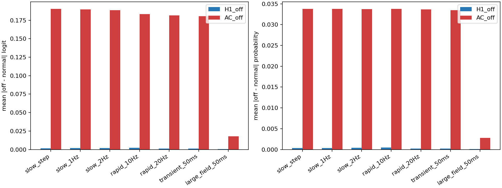
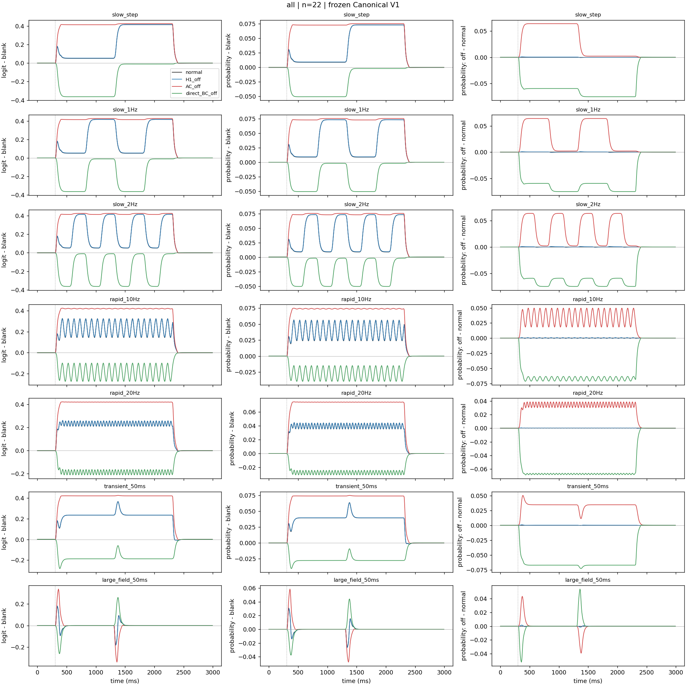

# Frozen H1 / AC temporal probe results

Metric: mean absolute off-minus-normal response over 300–2300 ms.
The large-field row is the requested spatial exception. Per-event onset/offset windows are 50 ms.

| Group | Probe | H1 logit | AC logit | H1 probability | AC probability |
|---|---|---:|---:|---:|---:|
| all | slow_step | 0.00167848096 | 0.190414364 | 0.000324133841 | 0.0337774565 |
| all | slow_1Hz | 0.001809913 | 0.189859197 | 0.000349757406 | 0.0337659613 |
| all | slow_2Hz | 0.00206804521 | 0.188730803 | 0.000400098078 | 0.0337430754 |
| all | rapid_10Hz | 0.0023093329 | 0.183508144 | 0.000450859047 | 0.0337885459 |
| all | rapid_20Hz | 0.00123881176 | 0.181635204 | 0.000240327114 | 0.0336770158 |
| all | transient_50ms | 0.00107855876 | 0.180629206 | 0.000211380749 | 0.0334929799 |
| all | large_field_50ms | 0.000637587385 | 0.0177682535 | 0.000110455372 | 0.00276855112 |
| MC_ON | slow_step | 0.000424836203 | 0.237173942 | 7.44519726e-05 | 0.0423824854 |
| MC_ON | slow_1Hz | 0.000605444075 | 0.237133098 | 0.000106661867 | 0.0424914241 |
| MC_ON | slow_2Hz | 0.000965581386 | 0.237065336 | 0.000170853196 | 0.0427171424 |
| MC_ON | rapid_10Hz | 0.00175346259 | 0.233816615 | 0.000314564147 | 0.0435584024 |
| MC_ON | rapid_20Hz | 0.000767711096 | 0.231285015 | 0.000138200271 | 0.0434807241 |
| MC_ON | transient_50ms | 0.000336074823 | 0.230091932 | 5.92781798e-05 | 0.0432644211 |
| MC_ON | large_field_50ms | 0.000639354673 | 0.0222271267 | 0.000104758312 | 0.00355434148 |
| MC_OFF | slow_step | 0.00297783833 | 0.175817754 | 0.000523493538 | 0.0339562357 |
| MC_OFF | slow_1Hz | 0.00317936094 | 0.175793733 | 0.000562081957 | 0.0339999665 |
| MC_OFF | slow_2Hz | 0.00357182644 | 0.175755501 | 0.000637297075 | 0.0340922619 |
| MC_OFF | rapid_10Hz | 0.00481992884 | 0.17364464 | 0.000883506764 | 0.0343471775 |
| MC_OFF | rapid_20Hz | 0.00299433956 | 0.171698857 | 0.000554994192 | 0.034229124 |
| MC_OFF | transient_50ms | 0.00283940506 | 0.170901764 | 0.000531220612 | 0.034088118 |
| MC_OFF | large_field_50ms | 0.00129289126 | 0.0156873628 | 0.000213936302 | 0.00267925416 |
| PC_ON | slow_step | 0.000749800539 | 0.194196708 | 0.000114931415 | 0.0308370206 |
| PC_ON | slow_1Hz | 0.000809642355 | 0.192973117 | 0.000124715916 | 0.0307288237 |
| PC_ON | slow_2Hz | 0.000926266762 | 0.190475312 | 0.000143786323 | 0.0305065491 |
| PC_ON | rapid_10Hz | 0.000749815968 | 0.181914692 | 0.000121011266 | 0.030140026 |
| PC_ON | rapid_20Hz | 0.000406925119 | 0.180123246 | 6.5557007e-05 | 0.0300482054 |
| PC_ON | transient_50ms | 0.000360894799 | 0.179015827 | 5.81269374e-05 | 0.0298560708 |
| PC_ON | large_field_50ms | 0.000210287261 | 0.0183974399 | 2.95429952e-05 | 0.00256212314 |
| PC_OFF | slow_step | 0.0040357105 | 0.138051227 | 0.000907581936 | 0.0294583719 |
| PC_OFF | slow_1Hz | 0.00419666017 | 0.137825966 | 0.000947645633 | 0.0294586872 |
| PC_OFF | slow_2Hz | 0.00451134527 | 0.137362793 | 0.00102615663 | 0.0294584893 |
| PC_OFF | rapid_10Hz | 0.00400248796 | 0.134071328 | 0.00093073746 | 0.0292267636 |
| PC_OFF | rapid_20Hz | 0.00194390475 | 0.132911194 | 0.000446551329 | 0.0290350956 |
| PC_OFF | transient_50ms | 0.00186056129 | 0.132158343 | 0.000426490171 | 0.0288665858 |
| PC_OFF | large_field_50ms | 0.000941499675 | 0.0128598833 | 0.000196148613 | 0.00234007309 |

[All per-cell metrics](per-cell.csv) · [Group metrics](group-summary.csv) · [Every event](per-event-onset-offset.csv)

[Stimulus matching](stimulus-statistics.csv) · [Inputs](inputs.pt) · [Responses](responses.pt) · [Protocol](protocol.json)

